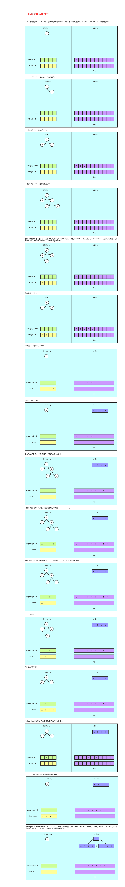
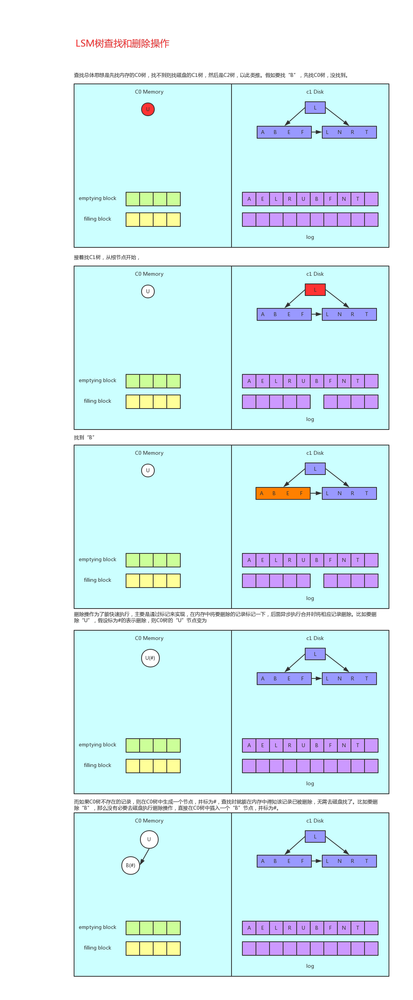

# Table of Contents

* [HBase](#hbase)
  * [关系型数据库与非关系型数据库](#关系型数据库与非关系型数据库)
    * [关系型数据库](#关系型数据库)
    * [非关系型数据库](#非关系型数据库)
  * [HBase简介](#hbase简介)
  * [HBase数据模型](#hbase数据模型)
  * [HBase架构](#hbase架构)
  * [HBase读写流程](#hbase读写流程)
    * [读流程](#读流程)
    * [写流程](#写流程)
  * [HBase Shell基础操作](#hbase-shell基础操作)
    * [通用命令](#通用命令)
    * [DDL操作](#ddl操作)
    * [NameSpace操作](#namespace操作)
    * [DML操作](#dml操作)
  * [HBase的LSM树存储结构](#hbase的lsm树存储结构)
    * [LSM树的由来](#lsm树的由来)
    * [LSM树的设计思想和原理](#lsm树的设计思想和原理)
    * [LSM树插入和合并操作](#lsm树插入和合并操作)
    * [LSM树查找和删除操作](#lsm树查找和删除操作)
  * [HBase数据存储](#hbase数据存储)
  * [HBase数据读取流程](#hbase数据读取流程)
  * [HBase优化设计](#hbase优化设计)
    * [表设计](#表设计)


# HBase

## 关系型数据库与非关系型数据库

### 关系型数据库

- 关系型数据库最典型的数据结构是表，由二维表及其之间的联系所组成的一个数据组织

- 优点
  - 易于维护：都是使用表结构，格式一致
  - 使用方便：SQL语言通用，可用于复杂查询
  - 复杂操作：支持SQL，可用于一个表以及多个表之间非常复杂的查询
- 缺点
  - 读写性能比较差，尤其是海量数据的高效率读写
  - 固定的表结构，欠缺灵活度
  - 高并发读写需求，传统关系型数据库，硬盘IO是一个很大的瓶颈


### 非关系型数据库

- 非关系型数据库严格上不是一种数据库，应该是一种数据结构化存储方法的集合，可以是文档或键值对
- 优点
  - 格式灵活：存储数据的格式可以是key，value形式，文档形式，图片形式等等，使用灵活，应用场景广泛，而关系型数据库则支持基础数据类型
  - 速度快：nosql可以使用硬盘或者随机存储器作为载体，而关系型数据库只能使用硬盘
  - 高扩展性
  - 成本低：nosql数据库部署简单，基本都是开源软件
- 缺点
  - 不提供sql支持，学习和使用成本较高
  - 无事务处理
  - 数据结构相对复杂，复杂查询方面稍欠缺


## HBase简介

- HBase的全称是Hadoop DataBase，是一个高可靠性，高性能，面向列，实时读写的分布式数据库
- 利用Hadoop HDFS作为其文件存储系统，利用Hadoop MapReduce来处理HBase中的海量数据，利用ZooKeeper作为其分布式协同服务
- 主要用来存储非结构化和半结构化数据的松散数据


## HBase数据模型

- RowKey
  - 决定一行数据，每行记录的唯一标识
  - 按照字典序排序
  - RowKey最多只能存储64K的字节数据
- Column Family
  - HBase表中的没格列都归属于某个列簇，列簇必须作为表模式定义的一部分预先给出，create 'test','course';
  - 列名以列簇作为前缀，每个列簇可以有多个列成员，如course:math,course:englist，新的列簇成员可以随后按需，动态加入
  - 权限控制，存储以及调优都是在列簇层面进行
  - HBase把同一列簇里面的数据存储在同一个目录下，由几个文件保存
- TimeStamp
  - 在HBase每个cell存储单元对同一份数据有多个版本，根据唯一的时间戳来区分每个版本之间的差异，不同版本的数据按照时间倒序排序
  - 时间戳的类型是64位整型
  - 时间戳可以由HBase在写入数据时自动复制，此时间戳是精确到毫秒的当前系统时间
  - 时间戳也可以由客户显式赋值，如果应用程序要避免数据版本冲突，就必须自己生成具有唯一性的时间戳


- **<font color='red'>由RowKey，column，version确定唯一单元</font>**
- **<font color='red'>cell中的数据是没有类型的，全部是字节数组形式进行存储的</font>**


## HBase架构


- Client

  - 包含访问HBase的接口并维护cache来加快对HBase的访问

- ZooKeeper

  - 保证任何时候，集群中只有一个活跃Master
  - 存储所有Region的寻址入口
  - 实时监控Region Server的上线和下线信息，并实时通知Master
  - 存储HBase的schema和table元数据

- Master

  - 为Region Server分配Region
  - 负责Region Server的负载均衡
  - 发现失效的Region Server并重新分配其上的Region
  - 管理用户对Table的增删改操作

- Region Server

  - Region Server维护Region，处理对这些Region的IO请求
  - Region Server负责切分在运行过程中变得很大的Region

- Region Server组件介绍

  - Region

    - HBase自动把表水平划分成多个区域（Region），每个Region会保存一个表里某段连续的数据
    - 每个表一开始只有一个Region，随着数据不断插入表，Region不断增大，当增大到一个阈值的时候，Region就会等分两个新的Region（裂变）
    - 当table中的行不断增多，就会有越来越多的Region，这样一张完整的表会被保存在多个Region Server上

  - MemStore与StoreFile

    - 一个Region由多个Store组成，一个Store对应一个列簇

    - Store包括位于内存中的MemStore和位于磁盘的StoreFile，写操作先写入MemStore，当MemStore中的数据达到某个阈值，HRegionServer会启动flashcache进程，写入StoreFile，每次写入形成一个单独的StoreFile

    - 当StoreFile文件的数量增长到一定阈值后，系统会进行合并（minor、major），在合并过程中，会进行版本合并和删除工作（major），形成更大的StoreFile

    - 当一个Region所有的StoreFile的大小和数量都超过一定的阈值以后，会把当前的Region分割为两个，并由HMaster分配到相应的RegionServer服务器，实现负载均衡

    - 客户端检索数据，先在MemStore中找，找不到去BlockCache，再找不到去StoreFile中找

      

    - **<font color='red'>HRegion是HBase中分布式存储和负载均衡的最小单元，最小单元表示不同的HRegion可以分布在不同的Hegion Server上</font>**

    - **<font color='red'>HRegion由一个或者多个Store组成，每个Store保存一个Column Family</font>**

    - **<font color='red'>每个Store又由一个MemStore和0至多个StoreFile组成，StoreFile以HFile格式保存在HDFS上</font>**


## HBase读写流程

### 读流程

- 客户端从ZooKeeper中获取meta表所在的Region Server节点信息
- 客户端访问meta表所在的Region Server，获取到Region所在的Region Server信息
- 客户端访问具体的Region所在的Region Server，找到对应的Region及Store
- 首先从MetaStore中读取数据，如果读取到了那么直接将数据返回，如果没有，则去blockcache读取数据
- 如果blockcache中读取到数据，则直接将数据返回，如果读取不到，则遍历StoreFile文件，查找数据
- 如果从StoreFile中读取不到数据，则返回客户端为空，如果读取到数据，那么先将数据缓存到blockcache中，然后再将数据返回给客户端
- blockcache是内存空间，如果缓存的数据比较多，满了之后会采用LRU策略，将较老的数据删除


### 写流程

- 客户端从ZooKeeper中获取meta表所在的RegionServer节点信息
- 客户端访问meta表所在的Region Server节点，获取到Region所在的Region Server信息
- 客户端访问具体的Region所在的Region Server，找到对应的Region及Store
- 开始写数据，写数据的时候会先从HLog中写一份数据（方便MetaStore中数据丢失后能够从HLog恢复数据，向HLog中写数据的时候也是优先写入内存，后台会有一个线程，定期异步刷写数据到HDFS，如果HLog的数据也写入失败，那么数据就会发生丢失）
- HLog数据写入完成之后，会先将数据写入到MemStore，MemStore默认大小是64MB，当MemStore满了之后会进行统一的溢写操作，将MemStore中的数据持久化到HDFS中
- 频繁的溢写会导致产生很多的小文件，因此会进行文件的合并，文件在合并的时候有两种，minor和major，minor是小范围文件的合并，major表示将所有的StoreFile文件都合并成一个


## HBase Shell基础操作

### 通用命令

```java
// 展示regionserver的task列表
hbase(main):000:0>processlist
// 展示集群的状态
hbase(main):000:0>status
// table命令的帮助手册
hbase(main):000:0>table_help
// 显示hbase的版本
hbase(main):000:0>version
// 展示当前hbase的用户
hbase(main):000:0>whoami
```


### DDL操作

```java
// 修改表的属性
hbase(main):000:0>alter 't1', NAME => 'f1', VERSIONS => 5
// 创建表
hbase(main):000:0>create 't1', 'cf'
// 查看表描述，只会展示列簇的信息
hbase(main):000:0>describe 'test'
// 禁用表
hbase(main):000:0>disable 'test'
// 禁用所有表
hbase(main):000:0>disable_all
// 删除表
hbase(main):000:0>drop 'test'
// 删除所有表
hbase(main):000:0>drop_all
// 启用表
hbase(main):000:0>enable 'test'
// 启用所有表
hbase(main):000:0>enable_all
// 判断表是否存在
hbase(main):000:0>exists 'test'
// 获取表
hbase(main):000:0>get_table 'test'
// 判断表是否被禁用
hbase(main):000:0>is_disabled 'test'
// 判断表是否被启用
hbase(main):000:0>is_enabled 'test'
// 展示所有表
hbase(main):000:0>list
// 展示表所占用的Region
hbase(main):000:0>list_regions
// 定位某个RowKey所在的行在哪个Region
hbase(main):000:0>locate_region
// 展示所有的过滤器
hbase(main):000:0>show_filters
```

### NameSpace操作

```java
//修改命名空间的属性
hbase(main):000:0>alter_namespace 'my_ns', {METHOD => 'set', 'PROPERTY_NAME' => 'PROPERTY_VALUE'}
//创建命名空间
hbase(main):000:0>create_namespace 'my_ns'
//获取命名空间的描述信息
hbase(main):000:0>describe_namespace 'my_ns'
//删除命名空间
hbase(main):000:0>drop_namespace 'my_ns'
//展示所有的命名空间
hbase(main):000:0>list_namespace
//展示某个命名空间下的所有表
hbase(main):000:0>list_namespace_tables 'my_ns'
```


### DML操作

```java
//向表中追加一个具体的值
hbase(main):000:0>append 't1', 'r1', 'c1', 'value', ATTRIBUTES=>{'mykey'=>'myvalue'}
//统计表的记录条数，默认一千条输出一次
hbase(main):000:0>count 'test'
//删除表的某一个值
hbase(main):000:0>delete 't1', 'r1', 'c1', ts1
//删除表的某一个列的所有值
hbase(main):000:0>deleteall 't1', 'r1', 'c1'
//获取表的一行记录
hbase(main):000:0>get 't1', 'r1'
//获取表的一个列的值的个数
hbase(main):000:0>get_counter 't1', 'r1', 'c1'
//获取表的切片
hbase(main):000:0>get_splits 't1'
//增加一个cell对象的值
hbase(main):000:0>incr 't1', 'r1', 'c1'
//向表中的某一个列插入值
hbase(main):000:0>put 't1', 'r1', 'c1', 'value’, ts1
//扫描表的全部数据
hbase(main):000:0>scan 't1'
//清空表的所有数据
hbase(main):000:0>truncate
```


## HBase的LSM树存储结构

### LSM树的由来

- Hash存储的方式支持增、删、改以及随机读取操作，但是不支持顺序扫描，对应的存储系统为K-V存储系统，对于K-V的插入及查询，要比树的操作块，如果不需要有序的遍历数据
- B+树不仅支持单挑记录的增、删、读、改操作，还支持顺序扫描（B+树的叶子节点之间的指针），对应的存储系统就是关系数据库。但是删除和更新操作比较麻烦
- LSM树（Log-Structed Merge Tree）存储结构和B树存储引擎一样，同样支持增、删、改、读、顺序扫描操作。而且通过批量存储技术规避磁盘随机写入问题。LSM树和B+树相比，LSM树牺牲了部分读性能，用来大幅度提高写性能


### LSM树的设计思想和原理

- 将对数据的修改和增量保持在内存中，达到指定的大小限制后将这些修改操作批量写入磁盘，不过读取的时候比较麻烦，需要合并磁盘中历史数据和内存中最近修改操作，所以写入性能大大提升，读取时可能需要先查看是否命中内存，否则需要访问较多的磁盘文件。极端的说，基于LSM树实现的HBase的写性能比MySQL高了一个数量级，读性能低了一个数量级
- LSM树的原理是把一棵大树拆分成N棵小树，首先写入内存中，随着小树越来越大，内存中的小树会flush到磁盘中，磁盘中的树定期做Merge操作，合并成一颗大树，以优化读性能
- 在HBase中，LSM树的应用流程对应如下
  - 小树先存到内存中，为了防止内存数据丢失，写内存的同时，将数据持久化到硬盘，对应了HBase的MemStore和HLog
  - MemStore上的树达到一定大小之后，需要flush到HRegion磁盘中，一般是Hadoop DataNode，这样MemStore就变成了DataNode上的磁盘文件StoreFile，定期HRegionServer对DataNode的数据做Merge操作，彻底删除无效空间，多棵小树在这个实际合并成大树，增加读性能


### LSM树插入和合并操作



### LSM树查找和删除操作



## HBase数据存储

- HDFS存储目录

  - /hbase/data/'namespace'/'table_name'/'region_id'/'列簇'/'store_file_id'
  - 例：/hbase/data/default/file_test/d51fef8b-8f8f-4d47-a5a4/cf1/d90e2597-56fa-4292-8729
  - 例：/hbase/data/default/file_test/d51fef8b-8f8f-4d47-a5a4/cf2/cd3d91b6-7402-4b65-887f

- StoreFile存储结构

  

  


## HBase数据读取流程

- 和写流程相比，HBase读数据是一个更加复杂的操作流程，这主要基于两个方面的原因，其一是因为整个HBase存储引擎基于LSM树实现，因此一次范围查询可能会涉及多个分片，多块缓存甚至多个数据存储文件。其二是因为HBase中更新操作以及删除操作实现都很简单，更新操作并没有更新原有数据，而是使用时间戳属性实现了多版本。删除操作也并没有真正删除原有数据，只是插入了一条打上“deleted”标签的数据，而真正的数据删除发生在系统异步执行的Major_Compact的时候。这种实现方法大大简化了数据更新，删除流程，但是对于数据读取来说却意味着套上了层层枷锁，读取过程中需要根据版本进行过滤，同时对已经标记删除的数据也要进行过滤
- 构建Scanner体系-组件施工队
  - scanner的体系核心在于三层scanner：RegionScanner、StoreScanner以及StoreFileScanner。三者是层级的关系，一个RegionScanner由多个StoreScanner构成，一张表由多个列簇组成，就有多少个StoreScanner负责该列簇的数据扫描。一个StoreScanner又是由多个StoreFileScanner组成。每个Store的数据由内存中的MemStore和磁盘上的StoreFile文件组成，相对应的，StoreScanner对象会雇佣一个MemStoreScanner和多个StoreFileScanner来进行实际的数据读取，每个StoreFile文件对应一个StorFileScanner。
  - StoreFileScanner和MemStoreScanner是整个Scan的最终执行者
- 搜索过程
  - RegionScanner会根据列簇构建StoreScanner，有多少列簇就构建多少个StoreScanner，用于该列簇的数据检索
  - 每个StoreScanner会为当前的Store中每个HFile构造一个StoreFileScanner，用于实际执行对应文件的搜索。同时会为对应的MemStore构造一个MemStoreScanner，用于执行该Store中MemStore的数据检索
  - 过滤淘汰StoreFileScanner：根据Time Range以及RowKey Range对StoreFileScanner以及MemStoreScanner进行过滤，淘汰肯定不存在待检索结果的Scanner
  - Seek RowKey：所有StoreFileScanner开始做准备工作，在负责的HFile中定位到满足条件的起始Row，Seek过程是很核心的步骤，包含以下三步
    - 定位Block OffSet：在BlockCache中读取该HFile的索引树结构，根据索引树检索对应RowKey所在的Block Offset和Block Size
    - Load Block：根据Block OffSet首先在Block Cache中查找Data Block，如果不在缓存，再在HFile中加载
    - Seek Key：在Data Block内部通过二分查找的方式定位具体的Row Key
    - StoreFileScanner合并构建最小堆：将该Store中所有StoreFileScanner和MemStroreScanner合并形成一个heap，所谓heap是一个优先级队列，队列中所有元素是所有Scanner，排序规则按照scanner seek到的key value大小由小到大进行排序


- <font color='red'>**为什么这些Scanner需要由小到大排序**</font>
  - scan的结果需要由小到大输出给用户，并且只有由小到大排序才能使 scan的效率最高，HBase支持数据多版本，假设用户只想获取最新的版本，那么只需要将这些数据由最新到最旧排序，然后取队首元素返回就可以了


## HBase优化设计

### 表设计

- Pre-Creating Regions

  - 默认情况下，在创建HBase表的时候会自动创建一个Region分区，当导入数据的时候，所有的HBase客户端都向这一个Region写数据，直到这个Region足够大了以后才会进行切分。一种可以加快批量写入速度的方法是通过预先创建一些空的Regions，当数据写入HBase时，会按照Region分区情况，在集群内进行数据的负载均衡

    ```java
    //第一种实现方式是使用admin对象的切分策略
    byte[] startKey = ...;      // your lowest key
    byte[] endKey = ...;        // your highest key
    int numberOfRegions = ...;  // # of regions to create
    admin.createTable(table, startKey, endKey, numberOfRegions);
    //第二种实现方式是用户自定义切片
    byte[][] splits = ...;   // create your own splits
    /*
    byte[][] splits = new byte[][] { Bytes.toBytes("100"),
                    Bytes.toBytes("200"), Bytes.toBytes("400"),
                    Bytes.toBytes("500") };
    */
    admin.createTable(table, splits);
    ```

  

### RowKey设计

- HBase中RowKey用来检索表中的记录，支持以下三种方式
  - 通过单个RowKey访问：即按照某个RowKey进行get操作
  - 通过RowKey的range进行scan：即通过设置startRowKey和endRowKey，在这个范围内进行扫描
  - 全表扫描：即直接扫描整张表中所有记录
- RowKey设计原则
  - **越短越好，提高效率**
    - 数据的持久化文件HFile中是按照KeyValue形式存储的，如果RowKey过长，比如设置100字节，1000w行数据，RowKey数据就占用十亿字节，将近1G的数据，这样会影响HFile的存储效率
    - HBase中包含缓存机制，每次会将查询的结果暂时缓存到HBase的内存中，如果RowKey过长，内存的利用率就会降低，系统不能缓存更多的数据，降低检索的效率
  - **散列原则，实现负载均衡**
    - 如果RowKey是按照时间戳的方式递增，不要将时间放在前面，建议将RowKey的高位作为散列字段，低位放时间字段，这样将提高数据均衡分布在每个RegionServer，实现了负载均衡。如果没有散列字段，首字段是根据时间信息将产生所有的新数据都在一个RegionServer上，出现数据堆积的热点现象，这样做数据检索的时候，负载将会集中在一个RegionServer上，降低查询的效率
    - 散列方式
      - 加盐：添加随机值
      - hash：采用md5散列算法取前四位做前缀
      - 反转：手机号反转
  - **唯一原则，字典序排序存储**
    - 必须在设计上保证其唯一性，RowKey是按照字典序，排序存储的，因此在设计RowKey的时候，充分利用该特点，将经常读取的数据存储到一块，将最近可能会被访问的数据放在一起


### 列簇设计

- 不要在一张表定义太多的列簇，目前HBase并不能很好的处理超过2-3个列簇的表，因为某个列簇在flush的时候，它邻近的列簇也会因为关联效应出发flush，最终导致系统产生更多的IO
  - 当开始向HBase中插入数据的时候，数据会首先写入到MemStore，MemStore是一个内存结构，每个列簇对应一个MemStore，每个列簇对应一个MemStore，当包含更多的列簇的时候，会导致存在多个MmeStore，每个MemStore在flush的时候会对应一个HFile文件，因此会产生很多的HFile文件，更加严重的时候，flush操作是Region级别，当Region中的MemStore被flush时，同一个Region的MemStore也会进行flush操作，当某一张表拥有很多列簇，且列簇之间的数据分布不均匀的时候，会产生更多的磁盘文件
  - 当Hbase表的某个Region过大时，会被拆分成两个，如果我们有多个列簇，且列簇之间数据量相差悬殊的时候，Region的split操作会导致原本数据量小的文件被进一步的切分，而产生更多的小文件
  - 与flush操作一样，目前HBase的Compaction操作也是Region级别的，过多的列簇也会产生不必要的IO
  - HDFS对一个目录下的文件数有限制，如果我们有N个列簇，M个Region，那么我们持久化到HDFS至少会产生N * M个文件，而每个列簇对应底层的HFile文件又不止一个，假设为K个，那么该表最终在HDFS目录下的生成的文件个数N * M * K个，有可能会超过HDFS的限制


### in memory

- HBase在LRU缓存基础之上采用了分层设计，整个BlockCache分成了三个部分，分别是single，multi，inMemory
  - single：如果一个Block第一次被访问，放在该优先队列中
  
  - multi：如果一个Block被多次访问，则从single队列转移到multi队列
  
  - inMemory：优先级最高，常驻Cache，因此一般只有HBase的元数据，才会放到inMemor队列
  
    

### Max Version

- 创建表的时候，可以通过ColumnFamilyDescriptorBuilder.setMaxVersions(int maxVersions)设置表中数据的最大版本，如果只需要保存最新版本的数据，那么可以设置setMaxVersion(1)，保留更多的版本信息会占用更多的空间


### Time to live

- 创建表的时候，可以通过ColumnFamilyDescriptorBuilder.setTimeToLive(int timeToLive)设置表中数据的生命周期，过期数据将会被自动删除，假设只需要存储最近两天的数据，可以设置setTimeToLive(2 * 24 * 60 * 60)


### Compaction

- 在HBase中，数据在更新时首先写入HLog和内存MemStore中，MemStore中的数据是排序的，当MemStore累计到一定阈值之后，就会创建一个新的MemStore，并且将老的MemStore添加到flush队列，由单独的线程flush到磁盘上，成为一个StoreFile，由此同时，系统会在zk中，记录一个redo point，表示这个时刻之前的变更已经持久化到硬盘了

- StoreFile是只读的，一旦创建之后就不可以再修改，因此HBase的更新其实是不断追加的过程，当一个Store中的StoreFile达到一定阈值之后，就会进行一次合并，将对同一个Key的修改合并到一起，形成一个大的StoreFile，当StoreFile的大小达到一定阈值之后，在对StoreFile进行切分，等分为两个StoreFile

- 由于对表的更新是不断追加的，处理请求时，需要访问Store中全部的StoreFile和MemStore，将他们按照RowKey进行合并，由于StoreFile和MemStore都是经过排序的，并且StoreFile带有内存中索引，通常合并过程还是比较快的

- 实际应用中，可以考虑必要时手动进行major Compaction，将同一个RowKey的修改进行合并形成一个大的StoreFile，同时可以将StoreFile设置大一些，减少Split的发生次数

- HBase为了防止小文件过多，以保证查询效率，HBase需要在必要的时候将这些小的StoreFile合并形成相对较大的StoreFile，这个过程称为Compaction。在HBase中，主要分为Minor Compaction、Major Compaction

  - Minor Compaction：较小、很少文件的合并

    - hbase.hstore.compaction.min：默认值为 3，表示至少需要三个满足条件的store file时，minor compaction才会启动
    - hbase.hstore.compaction.max：默认值为10，表示一次minor compaction中最多选取10个store file
    - hbase.hstore.compaction.min.size：表示文件大小小于该值的store file，一定会加入到minor compaction的store file中
    - hbase.hstore.compaction.max.size：表示文件大小大于该值的store file 一定不会被添加到minor compaction
    - hbase.hstore.compaction.ratio：将 StoreFile 按照文件年龄排序，minor compaction 总是从 older store file 开始选择，如果该文件的 size 小于后面 hbase.hstore.compaction.max 个 store file size 之和乘以 ratio 的值，那么该 store file 将加入到 minor compaction 中。如果满足 minor compaction 条件的文件数量大于 hbase.hstore.compaction.min，才会启动。

  - Major Compaction：将所有的Store File合并成一个，触发Major Compaction条件

    - major_compact命令
    - majorCompact() API
    - RegionServer自动运行
      - hbase.hregion.majorcompaction：默认为24 小时
      - hbase.hregion.majorcompaction.jetter:默认值为0.2 防止region server 在同一时间进行major compaction）
      - hbase.hregion.majorcompaction.jetter参数的作用是：对参数hbase.hregion.majorcompaction 规定的值起到浮动的作用，假如两个参数都为默认值24和0.2，那么major compact最终使用的数值为：19.2~28.8 这个范围。

     

### HBase写表优化

#### 是否写入WAL，WAL是否需要同步

- 数据写入流程可以理解为一次顺序写WAL和一次写缓存，通常情况下，写缓存的延迟很低，因此提升写性能只能从写WAL入手
- WAL机制一方面是为了确保数据即时写入缓存丢失也可以恢复，另一方面是为了集群之间异步复制
- 对于部分业务可能不是特别关心异常情况下的数据丢失，而更关心数据的吞吐量，可以考虑不进行WAL的写入


#### Put是否可以同步批量提交

- HBase分别提供了单条put以及批量put的API接口，使用批量put接口可以减少客户端到RegionServer之间的RPC连接数，提高写入性能
- 批量put请求要么全部成功，要么抛出异常


#### Put是否可以异步批量提交

- 如果可以接受异常情况下少量数据丢失的话，还可以使用异步批量提交的方式提交请求
- 提交分为两阶段执行
  - 用户提交写请求之后，数据会写入客户端缓存，并返回用户写入成功
  - 当客户端缓存达到阈值（默认2M）之后批量提交给RegionServer
- 在某些情况下，客户端异常的情况下缓存数据可能丢失
- 使用方式：setAutoFlush(false)


#### Region是否太少

- 当前集群中表的Region个数如果小于RegionServer个数，可以考虑切分Region并尽可能分布到不同RegionServer来提高系统请求并发度，如果表的Region个数已经大于RegionServer个数，再增加Region个数效果并不明显


#### 写入请求是否不均衡

- 写入请求不均衡，如果不均衡，一方面会导致系统并发度较低，另一方面可能会造成部分节点负载很高，影响其他业务
- 解决方案：检查RowKey设计以及预分区策略，保证写入请求均衡


#### 写入数据KeyValue是否过大

- KeyValue大小对写入性能的影响巨大，一旦遇到写入性能比较差的情况，需要考虑是否由于写入KeyValue数据太大导致

  

### HBase读表优化

#### Scan缓存是否设置合理

- 一次Scan会返回大量数据，因此客户端发起一次Scan请求，实际并不会一次就将所有数据加载到本地，而是分成多次RPC请求进行加载，这样设计的原因是因为大量数据请求可能会导致网络带宽消耗严重，影响其他业务，另一方面因为数据量太大导致本地客户端发生OOM。在这样的设计模式下，用户会首先加载一部分数据到本地，然后遍历处理，再加载下一部分数据到本地处理，如此往复，直到所有数据全部加载完成。数据加载到本地就存放在Scan缓存中，默认是100条
- 大Scan场景下，增加Scan缓存，用以减少RPC次数


#### get请求是否可以批量请求

- HBase分别提供了单条get和批量get的API，使用批量get接口可以减少客户端到RegionServer的RPC连接数，提供读取性能。批量get请求要么成功返回所有数据，要么抛出异常


#### 请求是否可以显示指定列簇和列

- HBase不同列簇的数据分开存储在不同的目录下，如果一个表有多个列簇，只是根据RowKey而不指定列簇进行检索的话，不同列簇的数据需要单独进行检索，性能必然会比指定列簇查询差很多
- 可以指定列簇或者列进行精确查找的尽量指定查找


#### 离线批量读取请求是否设置禁止缓存

- 通常离线批量读取数据会进行一次性全表扫描，一方面数据量很大，另一方面请求只会执行一次。这种情况如果使用scan默认设置，就会将数据从HDFS加载出来之后放到缓存。大量数据进入缓存，必将其他实时业务热点数据挤出去，其他业务不得不从HDFS加载，进而会造成明显的读延迟
- 离线批量读请求设置禁用缓存


#### 读请求是否均衡

- 极端情况下，加入所有的读请求都落在一台RegionServer的某几个Region上，这一方面不能发挥整个集群的并发处理能力，另一方面势必造成该台RegionServer资源消耗严重
- 观察所有RegionServer的读请求QPS曲线，确认是否存在读请求不均衡的现象
- 检查RowKey设计以及预分区策略，保证读请求均衡


#### BlockCache是否设置合理

- BlockCache作为读缓存，对于读性能来说至关重要。默认情况下BlockCache和MemStore的配置相对比较均衡（各占40%），可以根据集群业务进行修正，比如读多写少的业务可以将BlockCache占比调大。
- BlockCache的策略选择也很重要，不同策略对读性能来说影响并不是很大，但是对GC的影响相当显著

-  JVM内存配置量 < 20G，BlockCache策略选择LRUBlockCache；否则选择BucketCache策略的offheap模式；


#### HFile文件是否太多

- HBase读取数据通常首先会到MemStore和BlockCache中检索（读取最近写入数据和热点数据），如果查找不到就会到文件中检索
- HBase的类LSM结构会导致每个Store包含多个HFile文件，文件越多，检索所需的IO次数必然越多，读取延迟也就越高
- 文件的数量通常取决于Conpaction的执行策略，一般和两个配置参数有关
  - hbase.hstore.compaction.min：一个Store中的文件数超过多少就会进行合并
  - hbase.hstore.compaction.max.size：合并的文件大小最大是多少，超过此大小的文件不能参与合并
- 观察RegionServer级别以及Region级别的StoreFile数，确认HFile文件是否过多
- hbase.hstore.compaction.min：默认3，设置需要根据Region大小确定，通常可以简单的认为hbase.hstore.compaction.max.size = RegionSize / hbase.hstore.compaction.min


#### Compaction是否消耗系统资源过多

- Compaction是将小文件合并为大文件，提高后序业务随机读性能，但是也会带来IO放大以及带宽消耗问题。正常配置情况下Minor Compaction并不会带来很大的系统资源消耗，除非因为配置不合理导致Minor Compaction太过频繁，或者Region设置太大情况下发生Major Compaction
- 观察系统IO资源以及带宽资源使用情况，在观察Compaction队列长度，确认是否由于Compaction导致系统资源消耗过多
- Minor Compaction：hbase.hstore.compaction.min设置不能太小，又不能设置太大，因此建议设置为5～6；hbase.hstore.compaction.max.size = RegionSize / hbase.hstore.compaction.min
- Major Compaction：大Region读延迟敏感业务（ 100G以上）通常不建议开启自动Major Compaction，手动低峰期触发。小Region或者延迟不敏感业务可以开启Major Compaction，但建议限制流量


#### 数据本地率是否太低

- 数据本地率：HDFS数据通常存储三份，假如当前RegionA处于Node1上，数据a写入的时候三副本为(Node1,Node2,Node3)，数据b写入三副本是(Node1,Node4,Node5)，数据c写入三副本(Node1,Node3,Node5)，可以看出来所有数据写入本地Node1肯定会写一份，数据都在本地可以读到，因此数据本地率是100%。现在假设RegionA被迁移到了Node2上，只有数据a在该节点上，其他数据（b和c）读取只能远程跨节点读，本地率就为33%（假设a，b和c的数据大小相同）。
- 数据本地率太低很显然会产生大量的跨网络IO请求，必然会导致读请求延迟较高，因此提高数据本地率可以有效优化随机读性能。数据本地率低的原因一般是因为Region迁移（自动balance开启、RegionServer宕机迁移、手动迁移等）,因此一方面可以通过避免Region无故迁移来保持数据本地率，另一方面如果数据本地率很低，也可以通过执行major_compact提升数据本地率到100%。
- 避免Region无故迁移，比如关闭自动balance、RS宕机及时拉起并迁回飘走的Region等；在业务低峰期执行major_compact提升数据本地率


 


