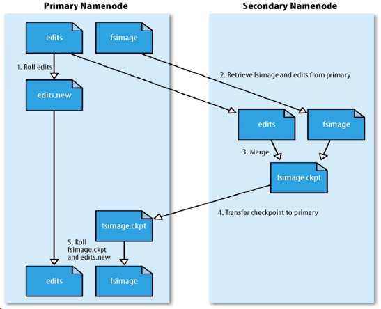
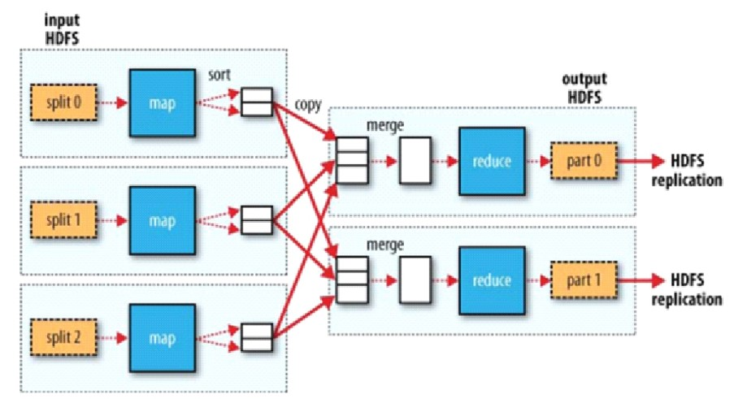
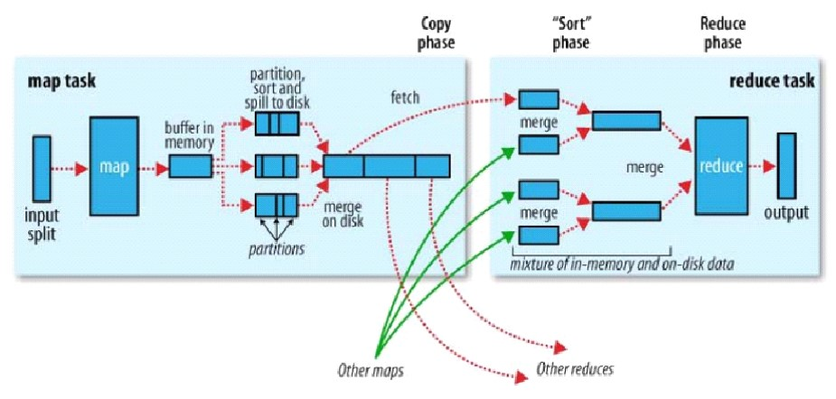

# Hadoop

## Hadoop的主要模块

- Hadoop Common
  - 基础模块
- Hadoop Distribute File System(HDFS)
  - 分布式文件系统
  
- Hadoop MapReduce

  - 分布式并行己算框架

- Hadoop Yarn
  - 资源管理平台
  
  

# HDFS

## HDFS的存储模型

- 文件线性按照字节切割成块（block），每块具有offset和id
- 文件与文件的block大小可以不一样
- 一个文件除了最后一个block，其他block大小一致
- block的大小可以依据硬件的I/O特性进行调整
- block被分散存在集群的节点中，具有location
- block具有副本（replication），没有主从概念，副本不能出现在同一个节点
- 文件上传可以指定block大小和副本数，上传后只能修改副本数
- 一次写入，多次读取，不支持修改
- 支持追加数据


## 副本（Block）放置策略

- 第一个副本
  - 放置在上传文件的DataNode，如果是集群外提交，则随机挑选一台磁盘不太满，CPU不太忙的节点
- 第二个副本
  - 放置在于第一个副本不同的机架的节点上
- 第三个副本
  - 与第二个副本相同机架的节点


## HDFS实现机架感知

- 在Hadoop目录创建机架感知的脚本，RackAware.py

  ```python
  #!/usr/bin/python  
  #-*-coding:UTF-8 -*-  
  import sys  
    
  rack = {  
  
          "12.12.3.1":"SW6300-1",  
          "12.12.3.2":"SW6300-1",  
          "12.12.3.3":"SW6300-1", 
  
          "12.12.3.25":"SW6300-2",  
          "12.12.3.26":"SW6300-2",  
          "12.12.3.27":"SW6300-2",  
   
          "12.12.3.49":"SW6300-3",  
          "12.12.3.50":"SW6300-3",  
          "12.12.3.51":"SW6300-3",  
       
          "12.12.3.73":"SW6300-4",  
          "12.12.3.74":"SW6300-4",  
          "12.12.3.75":"SW6300-4",  
  		}  
  if __name__=="__main__":  
      print "/" + rack.get(sys.argv[1],"SW6300-1-2")  
  ```

- 编辑core-site.xml

  ```xml
  <property>
  	<name>topology.script.file.name</name>
  	<value>/hadoop-2.6.0-cdh5.14.0/hadoop/etc/hadoop/RackAware.py</value>
  </property>
  ```


## HDFS的架构设计

- HDFS是一个主从（Master/Slaves）架构
- 由一个NameNode和一些DataNode组成
- 面向文件包含：文件数据（data）和文件元数据（metadata）
- NameNode负责存储和管理文件元数据，并维护了一个层次型的文件目录树
- DataNode负责存储文件数据（block），并提供block的读写
- DataNode与NameNode维持心跳，并汇报自己持有的block信息
- Client和NameNode交互元文件数据和DataNode交互文件block数据


## HDFS的角色功能

- NameNode
  - 完全基于内存存储元数据，目录结构，文件block的映射
  - 需要持久化方案保证数据可靠性
  - 提供副本放置策略
- SecondaryNameNode
  - 辅助NameNode合并FSImage和Editslog
- DataNode
  - 基于本地磁盘存储block（文件的形式）
  - 保存block的校验和数据，保证block的可靠性
  - 与NameNode保持心跳，汇报block列表状态
  
  

## HDFS的元数据持久化

### FSImage+Editslog

- 任何对文件系统元数据产生修改的操作，NameNode都会使用一种称为Editslog的事务日志记录下来
- 使用FSImage存储内存所有的元数据状态
- 使用本地磁盘保存Editslog和FSImage
- Editslog：完整性，数据丢失少，但恢复速度慢，并有体积膨胀的风险
- FSImage：恢复速度快，体积与内存数据相当，但不能实时保存，数据丢失多
- NameNode采用了FSImage+Editslog整合的方案
  - 滚动将增量的Editslog更新到FSImage，以保证更近时点的FSImage和更小体积的Editslog


### FSImage+Edistlog实现方案

- HDFS格式化命令，会产生一个空的FSImage

- 当NameNode启动时，它从硬盘中读取Editslog和FSImage

- 将所有的Editslog中的事务作用在内存中的FSImage

- 并将这个新版本的FSImage从内存中保存到磁盘中

- 然后删除旧的Editslog，因为这个旧的Editslog已经作用在FSImage上了

   


### 元数据持久化的SecondaryNameNode

- 在非HA模式下，SecondaryNameNode一般是独立的节点，周期完成对NameNode的Editslog向FSImage合并，减少Editslog的大小，减少NameNode的启动时间
- 根据配置文件设置的时间间隔fs.checkpoint.period，3600s
- 根据配置文件设置Editslog的大小fs.checkpoint.size，规定Editslog文件的最大值，默认是64MB


### 安全模式

- NameNode启动后进入一个称为安全模式的特殊状态
- 处于安全模式的NameNode是不会进行数据块的复制
- NameNode从所有的DataNode接受心跳信号和块状态报告
- 每当NameNode检测确认某个数据块的副本数目达到这个最小值，那么该数据块就会被认为是副本安全的
- 在一定百分比的数据块（可配置）被NameNode检测确认是安全之后（加上额外的30秒等待时间），NameNode会退出安全模式
- 接下来它会确定还有哪些数据块的副本没有达到指定数据，并将这些数据块复制到其他DataNode上


## HDFS读写流程

### HDFS读流程

- Client端加载FileSystem类，建立与NameNode的通信，发送读取数据的请求
- NameNode根据文件快的元数据，判断文件是否存在以及存在哪个DataNode-D1,D2,D3（不同block）
- NameNode回答Client端，不存在文件或者文件所在的DateNode
- Client实现FSDataInputStream类，建立与D1（存放block1）的通信，并请求下载数据
- D1接收到请求，将数据文件从磁盘读取到内存，以Packet为单位，发送给Client
- Client接收到Packet数据，先写到内存缓存，然后写入磁盘
- Block1读取下载完毕后，Client和D2建立通信，下载Block2
- 直到全部下载完成，关闭连接


- 为了降低整体的带宽消耗和读取延时，HDFS会尽量让读取程序读取离他最近的副本
- 如果读取程序的同一个机架上有一个副本，那么就读取该副本
  - Client和NameNode交互文件元数据获取fileBlockLocation
  - NameNode会按距离策略排序返回
  - Client尝试下载Block，并校验数据完整性


### HDFS写流程

- Client端加载FileSystem类，建立与NameNode的通信，发送上传数据请求
- NameNode检查文件是否存在以及要存放的父目录是否存在，然后回复是否可以进行上传
- Client端请求上传第一个Block
- NameNode根据副本数分配对应数量的DataNode节点，返回给Client
- Client加载FSDataOutputStream类，选择一个距离自己最近的DataNode请求建立通信，D1收到请求后调用D2，D2调用D3，然后分别回复Client，并建立数据通道
- Client以Packet形式，向D1传输Block1
- D1接收到Packet到内存，然后拷贝到本地磁盘，写完后内存中的Packet会传递给D2
- D2同样进行拷贝写，然后将内存中的数据传递给D3
- D3作为最后一站，直接将Packet写入到磁盘中
- 第一个Block上传完成后，Client将会再次发送请求上传第二个Block
- 直到所有Block完成上传，关闭管道连接


## Hadoop节点如何进行动态上下线

- 上线
  - 关闭新增节点的防火墙
  - 修改集群节点的host文件，增加新增节点的hostname
  - NameNode增加新增节点的免密码登录
  - 执行hdfs dfsadmin -refreshNodes（刷新操作）
  - 更改slaves节点，增加新增节点
  - 启动DataNode节点
  - 查看NameNode监控页面是否有新增节点
- 下线
  - 修改hdfs-site.xml
  - 配置hdfs.hosts.exclude中需要下架的机器
  - 执行hdfs dfsadmin -refreshNodes（刷新操作）
  - 关闭下架的机器
  - 机器下线完毕后，修改hdfs-site.xml，一处exclude


# MapReduce

## MapReduce的工作原理

 


- Map Task
  - 根据InputFormat将输入文件分为多个splits，每个splits会作为一个Map Task的输入
  - 每条数据经过map方法，映射成K-V键值对，相同的Key作为一组，调用一次Reduce方法
- Reduce Task
  - 每组数据在Reduce方法内进行迭代计算，并将最后结果输出至HDFS


## MapReduce的Shuffle过程



- Map端的Shuffle阶段
  - Partition：对于map输出的每一个键值对，系统会计算出相应的partition
  - Collector：环形数据缓冲区，将K-V-P存储于缓冲区，用于磁盘溢写，减少磁盘IO
  - Sort：将环形数据缓冲区的数据按照Partition，Key进行升序排序
  - Spill：将环形数据缓冲区的数据溢写到本地磁盘
  - Merge：将多次Spill后的文件进行归并排序，合并所有输出结果
- Reduce端的Shuffle阶段
  - Copy：复制Map端输出的数据文件
  - Merge Sort：从多个Map端Copy数据，进行归并排序，合并数据，情况可分为可分为内存-内存，内存-磁盘，磁盘-磁盘


## MapReduce的调度流程 

#### hadoop1.x

- Client

  - 根据每次的计算数据，询问NameNode元数据，得到Splits清单
  - 生成计算程序运行时需要的相关配置文件
  - 调用JobTracker，通知要启动一个计算程序，并且告知程序和配置文件放在了HDFS位置

- JobTracker

  - 从HDFS取回Splits清单
  - 根据自己收到的TaskTracker汇报的资源，最终确定每一个Split的map/reduce应该在哪个节点执行
  - 取回分配的任务信息

- TaskTracker

  - 接受任务信息
  - 从HDFS中下载程序和配置文件到本地
  - 启动任务描述中的MapTask/ReduceTask

  

- <font color='red'>**JobTracker问题**</font>

  - 容易造成单点故障
  - 单点压力过大
  - 集成了【资源管理和任务调度】两者耦合
    - 未来新的计算框架不能复用资源管理，重复造轮子
    - 各自实现资源管理，但是隔离，不能感知到对方的使用情况，造成资源争抢
    
    

#### hadoop2.x（Yarn）

- Client
  - 任务调度
- ResourceManager
  - 负责整体资源的管理
- NodeManager
  - 提交自己的资源情况


- 调度流程
  - Client询问NameNode得到Splits清单，并将程序，配置文件上传到HDFS，访问ResourceManager申请ApplicationMaster
  - ResourceManager选择一台不忙的节点通知NameNode启动一个Container，在里面反射形成一个ApplicationMaster
  - 启动ApplicationMaster，从HDFS下载切片清单，向ResourceManager申请资源
  - 由ResourceManager根据自己掌握的资源情况得到一个确定清单，通知NameNode来启动Container
  - Container启动会反向注册到ApplicationMaster
  - ApplicationMaster最近将任务Task发送到Container
  - Container会反射相应的Task类，调用方法执
  - 计算框架中对Task失败，都拥有重试的机制

 

- <font color='red'>**解决问题**</font>
  - 单点故障（曾经的JobTracker是全局，如果JobTracker发生故障，整个计算层不能再进行调度）
    - Yarn架构，每个Application拥有自己的ApplicationMaster
    - Yarn架构支持ApplicationMaster的失败重试
  - 单点压力过大（JobTracker只有一个，多个任务时，所有的调度都由一个JobTracker完成）
    - Yarn架构，每个任务都有对应的ApplicationMaster，每个ApplicationMaster只负责自己任务的调度
    - ApplicationMaster在不同节点中启动，默认拥有了负载的光环
  - 集成了【资源管理和任务调度】两者耦合
    - Yarn架构，只是资源管理，不负责具体的任务调度


## MapReduce任务的提交方式

### 集群模式

- maven进行package打包jar（不需要hadoop依赖），上传到集群中的某一个节点

- 执行提交命令：hadoop jar xx.jar xxx 

  - hadoop jar hadoop_test.jar com.tommy.mr.WordCount /input /output

  

### 集群模式（IDEA集成）

- 配置文件设置windows执行
  - conf.set("mapreduce.app-submission.cross-platform", "true");
- 设置jar包路径，需要将该jar推送到hdfs
  - job.setJar("D:\\Code\\hadoop_test\\target\\hadoop_test-1.0-SNAPSHOT.jar");
- maven进行package打包jar（不需要hadoop依赖）
- IDEA中直接运行主类


### 本地模式

- 配置文件设置本地模式运行
  - conf.set("mapreduce.framework.name", "local");
- 配置文件设置windows执行
  - conf.set("mapreduce.app-submission.cross-platform", "true");
- 本地解压hadoop
- 下载winutils，覆盖到hadoop/bin目录
- 环境变量配置HADOOP_HOME
- IDEA中直接运行主类


## MapReduce参数个性化

```java
//工具类帮我们把-D 等等的属性直接set到conf，会留下commandOptions
GenericOptionsParser parser = new GenericOptionsParser(conf, args);
String[] othargs = parser.getRemainingArgs();
```


## MapReduce源码详解(基于Hadoop3.1.4)

### Job

- 主程序中调用方法job.waitForCompletion(true)，进入到Job.java，查看waitForCompletion()方法

  ```java
  // line : 1584
  public boolean waitForCompletion(boolean verbose) throws IOException, InterruptedException, ClassNotFoundException {
  	// 提交任务
  	if (state == JobState.DEFINE) {
  		submit()
  	}
  }
  ```

- 进入Job.java，查看submit()方法

  ```java
  // line : 1560
  public void submit() throws IOException, InterruptedException, ClassNotFoundException {
  	// 确定未定义状态
  	ensureState(JobState.DEFINE);
  	// 设置调用新的API
      setUseNewAPI();
      // 连接
      connect();
      // 初始化任务提交器
      final JobSubmitter submitter = getJobSubmitter(cluster.getFileSystem(), cluster.getClient());
      status = ugi.doAs(new PrivilegedExceptionAction<JobStatus>() {
        	public JobStatus run() throws IOException, InterruptedException, 
        	ClassNotFoundException {
        		// 提交任务
          	return submitter.submitJobInternal(Job.this, cluster);
        	}
      });
      state = JobState.RUNNING;
      LOG.info("The url to track the job: " + getTrackingURL());
  }
  ```

- 进入JobSubmitter.java，查看submitJobInternal()方法

  ```java
  // line : 139
  JobStatus submitJobInternal(Job job, Cluster cluster) throws ClassNotFoundException, InterruptedException, IOException {
      
  	............
          
  	// 重点关注切片方法，line : 198
  	// Create the splits for the job
  	LOG.debug("Creating splits at " + jtFs.makeQualified(submitJobDir));
  	// 切片
      int maps = writeSplits(job, submitJobDir);
      // map任务数，对应切片数
      conf.setInt(MRJobConfig.NUM_MAPS, maps);
      LOG.info("number of splits:" + maps); 
      
      ............
          
  }
  ```

- 进入JobSubmitter.java，查看writeSplits()方法

  ```java
  // line : 321
  private int writeSplits(org.apache.hadoop.mapreduce.JobContext job, Path jobSubmitDir) 
  	throws IOException, InterruptedException,ClassNotFoundException {
  	JobConf jConf = (JobConf)job.getConfiguration();
      int maps;
      if (jConf.getUseNewMapper()) {
        maps = writeNewSplits(job, jobSubmitDir);
      } else {
        maps = writeOldSplits(jConf, jobSubmitDir);
      }
      return maps;
  }
  ```

- 进入JobSubmitter.java，查看writeNewSplits()方法

  ```java
  // line : 303
  private <T extends InputSplit> int writeNewSplits(JobContext job, Path jobSubmitDir) throws IOException,
  	InterruptedException, ClassNotFoundException {
      Configuration conf = job.getConfiguration();
      
      // 通过反射获取InputFormat，默认是TextInputFormat
      InputFormat<?, ?> input = ReflectionUtils.newInstance(job.getInputFormatClass(), conf);
  
      // 重点：进行切片
      List<InputSplit> splits = input.getSplits(job);
      T[] array = (T[]) splits.toArray(new InputSplit[splits.size()]);
  
      // sort the splits into order based on size, so that the biggest
      // go first
      Arrays.sort(array, new SplitComparator());
      JobSplitWriter.createSplitFiles(jobSubmitDir, conf, jobSubmitDir.getFileSystem(conf), array);
          
      // 返回数组长度，即切片个数为mapTask数
      return array.length;
  }
  ```

- getSplits()是个接口方法，进入到FileInputFormat实现类，查看getSplits()方法

  ```java
  // line : 389
  public List<InputSplit> getSplits(JobContext job) throws IOException {
  	StopWatch sw = new StopWatch().start();
      
      // 默认为1
      long minSize = Math.max(getFormatMinSplitSize(), getMinSplitSize(job));
      // 默认Long.MAX_VALUE
      long maxSize = getMaxSplitSize(job);
      
      // 忽略子文件夹
      boolean ignoreDirs = !getInputDirRecursive(job)
        && job.getConfiguration().getBoolean(INPUT_DIR_NONRECURSIVE_IGNORE_SUBDIRS, false);
      
      // 遍历文件
      for (FileStatus file: files) {
  		// 子文件夹
  	   	if (ignoreDirs && file.isDirectory()) {
          	continue;
        	}
        	// 文件路径
        	Path path = file.getPath();
        	// 文件长度
        	long length = file.getLen();
          
        	if (length != 0) {
          	// 文件块信息
              BlockLocation[] blkLocations;
          	if (file instanceof LocatedFileStatus) {
            		blkLocations = ((LocatedFileStatus) file).getBlockLocations();
          	} else {
            		FileSystem fs = path.getFileSystem(job.getConfiguration());
            		blkLocations = fs.getFileBlockLocations(file, 0, length);
          	}
              
              // 是否可切分
          	if (isSplitable(job, path)) {
                  
                  // 块大小
            		long blockSize = file.getBlockSize();
                  // 切片大小
            		long splitSize = computeSplitSize(blockSize, minSize, maxSize);
  				// 未切分大小
            		long bytesRemaining = length;
                  // SPLIT_SLOP : 1.1
                  // 未切分大小是切片大小的1.1倍以上，继续进行切片
            		while (((double) bytesRemaining) / splitSize > SPLIT_SLOP) {
                      // 计算切片Index
              		int blkIndex = getBlockIndex(blkLocations, length-bytesRemaining);
                      // 添加到切片数据集合
              		splits.add(makeSplit(path, length-bytesRemaining, splitSize,
                          blkLocations[blkIndex].getHosts(),
                          blkLocations[blkIndex].getCachedHosts()));
                      // 计算未切分数据
              		bytesRemaining -= splitSize;
            		}
  			
              	// 存在未切分数据
            		if (bytesRemaining != 0) {
                      // 计算切片Index
              		int blkIndex = getBlockIndex(blkLocations, length-bytesRemaining);
                  	// 添加到切片数据集合
              		splits.add(makeSplit(path, length-bytesRemaining, bytesRemaining,
                  		blkLocations[blkIndex].getHosts(),
                      	blkLocations[blkIndex].getCachedHosts()));
            		}
              // 不可切分
          	} else {
            		if (LOG.isDebugEnabled()) {
              		// Log only if the file is big enough to be splitted
              		if (length > Math.min(file.getBlockSize(), minSize)) {
                			LOG.debug("File is not splittable so no parallelization " + "is possible: " + file.getPath());
              		}
  				}
                  // 添加切片数据集合
            		splits.add(makeSplit(path, 0, length, blkLocations[0].getHosts(), blkLocations[0].getCachedHosts()));
          	}
          // 无数据
  		} else { 
          	//Create empty hosts array for zero length files
          	splits.add(makeSplit(path, 0, length, new String[0]));
        	}
      }
      
      // Save the number of input files for metrics/loadgen
      job.getConfiguration().setLong(NUM_INPUT_FILES, files.size());
      sw.stop();
      if (LOG.isDebugEnabled()) {
        	LOG.debug("Total # of splits generated by getSplits: " + splits.size() + ", TimeTaken: " + sw.now(TimeUnit.MILLISECONDS));
      }
      
      // 返回切片数据集合
      return splits;
  }
  ```
  
- getSplits()方法中，调用了computeSplitSize()，计算切片大小

  ```java
  // line : 459
  // blockSize : 块大小
  // minSize : 1
  // maxSize : Long.MAX_VALUE
  protected long computeSplitSize(long blockSize, long minSize, long maxSize) {
  	return Math.max(minSize, Math.min(maxSize, blockSize));
  }
  ```

- getSplits()方法中，调用了getBlockIndex()，计算切片索引

  ```java
  // line : 464
  // blkLocations : 块位置信息
  // offset : 当前数据偏移量
  // 判断当前数据偏移量处于哪个块位置上
  protected int getBlockIndex(BlockLocation[] blkLocations, long offset) {
  	for (int i = 0 ; i < blkLocations.length; i++) {
  		// is the offset inside this block?
        	if ((blkLocations[i].getOffset() <= offset) && (offset < blkLocations[i].getOffset() + blkLocations[i].getLength())) {
          	return i;
        	}
      }
      BlockLocation last = blkLocations[blkLocations.length -1];
      long fileLength = last.getOffset() + last.getLength() -1;
      throw new IllegalArgumentException("Offset " + offset + " is outside of file (0.." + fileLength + ")");
  }
  ```

- getSplits()方法中，调用了makeSplit()，制作切片信息

  ```java
  // line : 379
  // 最终切片数据包含信息：文件，偏移量，数据长度，host（机器位置）
  protected FileSplit makeSplit(Path file, long start, long length, String[] hosts, String[] inMemoryHosts) {
      return new FileSplit(file, start, length, hosts, inMemoryHosts);
  }
  ```

- 当切片大小和块大小不一致时，可能会导致数据向计算移动，如

  - 块大小为4，切片大小为6时，12字节的数据会产生两个MapTask任务，分别产生在B1，B3所在机器中，B1，B3的MapTask任务拉取B2数据
  - B2的数据被B1，B3所在机器的MapTask并行拉取，分治思想

### MapTask

- 首先进入MapTask.java，查看run()方法

  ```java
  // line : 311
  public void run(final JobConf job, final TaskUmbilicalProtocol umbilical) throws IOException, ClassNotFoundException, InterruptedException {
      
      this.umbilical = umbilical;
      
  	if (isMapTask()) {
      	// If there are no reducers then there won't be any sort. Hence the map 
        	// phase will govern the entire attempt's progress.
        	if (conf.getNumReduceTasks() == 0) {
              // 没有Reduce阶段，只需要进行Map操作
          	mapPhase = getProgress().addPhase("map", 1.0f);
  		} else {
          	// If there are reducers then the entire attempt's progress will be 
      	    // split between the map phase (67%) and the sort phase (33%).
              // 有Reduce阶段，将进度分为两部分，一部分Map，一部分Sort，易于Reduce拉取数据，减少IO
          	mapPhase = getProgress().addPhase("map", 0.667f);
  	        sortPhase  = getProgress().addPhase("sort", 0.333f);
        }
      }
  
      TaskReporter reporter = startReporter(umbilical);
   
      boolean useNewApi = job.getUseNewMapper();
      // 初始化
      initialize(job, getJobID(), reporter, useNewApi);
      
      ............
          
  	if (useNewApi) {
        	runNewMapper(job, splitMetaInfo, umbilical, reporter);
      } else {
        	runOldMapper(job, splitMetaInfo, umbilical, reporter);
      }
      done(umbilical, reporter);
  }
  ```

- 进入到MapTask.java，查看runNewMapper()方法

  ```java
  // line : 744
  private <INKEY,INVALUE,OUTKEY,OUTVALUE> void runNewMapper(final JobConf job, final TaskSplitIndex splitIndex, 
  	final TaskUmbilicalProtocol umbilical, TaskReporter reporter) throws IOException, ClassNotFoundException,InterruptedException {
   
  	// make a task context so we can get the classes
      // 初始化taskContext
      org.apache.hadoop.mapreduce.TaskAttemptContext taskContext =
          new org.apache.hadoop.mapreduce.task.TaskAttemptContextImpl(job, getTaskID(), reporter);
      
  	// make a mapper
      // 通过反射获取主程序中设置的Mapper类，并进行初始化
      org.apache.hadoop.mapreduce.Mapper<INKEY,INVALUE,OUTKEY,OUTVALUE> mapper =
          (org.apache.hadoop.mapreduce.Mapper<INKEY,INVALUE,OUTKEY,OUTVALUE>) ReflectionUtils.newInstance(taskContext.getMapperClass(), job);
      
      // make the input format
      // 通过反射获取主程序中设置的InputFormat类，并进行初始化，默认为TextInputFormat.class
      org.apache.hadoop.mapreduce.InputFormat<INKEY,INVALUE> inputFormat =
  		(org.apache.hadoop.mapreduce.InputFormat<INKEY,INVALUE>) ReflectionUtils.newInstance(taskContext.getInputFormatClass(), job);
      
  	// rebuild the input split
      // 读取切片信息
      org.apache.hadoop.mapreduce.InputSplit split = null;
      split = getSplitDetails(new Path(splitIndex.getSplitLocation()), splitIndex.getStartOffset());
      LOG.info("Processing split: " + split);
      
      // RecordReader，通过split+inputFormat实现读取每行数据
  	org.apache.hadoop.mapreduce.RecordReader<INKEY,INVALUE> input =
          new NewTrackingRecordReader<INKEY,INVALUE>(split, inputFormat, reporter, taskContext);
      
      job.setBoolean(JobContext.SKIP_RECORDS, isSkipping());
      // RecordWriter
      org.apache.hadoop.mapreduce.RecordWriter output = null;
      
      // get an output object
      if (job.getNumReduceTasks() == 0) {
        	output = new NewDirectOutputCollector(taskContext, job, umbilical, reporter);
      } else {
        	output = new NewOutputCollector(taskContext, job, umbilical, reporter);
      }
      
      // 初始化MapContext，将RecordReader进行赋值
      org.apache.hadoop.mapreduce.MapContext<INKEY, INVALUE, OUTKEY, OUTVALUE> mapContext = 
        new MapContextImpl<INKEY, INVALUE, OUTKEY, OUTVALUE>(job, getTaskID(), input, output, committer, reporter, split);
      
      // 初始化MapperContext，将MapContext进行赋值，MapperContext中包含了RecordReader
  	org.apache.hadoop.mapreduce.Mapper<INKEY,INVALUE,OUTKEY,OUTVALUE>.Context mapperContext = 
            new WrappedMapper<INKEY, INVALUE, OUTKEY, OUTVALUE>().getMapContext(mapContext);
  
      // Map流程
      try {
          // RecordReader初始化
        	input.initialize(split, mapperContext);
          // 执行Map方法
        	mapper.run(mapperContext);
  		// Map阶段完成
          mapPhase.complete();
          // 开始Sort阶段
        	setPhase(TaskStatus.Phase.SORT);
          // 更新状态
        	statusUpdate(umbilical);
  		// 关闭流
        	input.close();
        	input = null;
        	output.close(mapperContext);
        	output = null;
      } finally {
        closeQuietly(input);
        closeQuietly(output, mapperContext);
      }
  }
  ```

- 观察try-catch方法块中的主流程，调用了initialize()方法，进入到LineRecordReader.java，查看initialize()方法

  ```java
  // line : 75
  public void initialize(InputSplit genericSplit, TaskAttemptContext context) throws IOException {
      
  	FileSplit split = (FileSplit) genericSplit;
      Configuration job = context.getConfiguration();
      this.maxLineLength = job.getInt(MAX_LINE_LENGTH, Integer.MAX_VALUE);
      
      start = split.getStart();
      end = start + split.getLength();
      final Path file = split.getPath();
  
      // open the file and seek to the start of the split
      final FileSystem fs = file.getFileSystem(job);
      fileIn = fs.open(file);
      
      CompressionCodec codec = new CompressionCodecFactory(job).getCodec(file);
      if (null!=codec) {
          
        ............
            
      } else {
          // 定位到起始位置
  		fileIn.seek(start);
        	in = new UncompressedSplitLineReader(fileIn, job, this.recordDelimiterBytes, split.getLength());
        	filePosition = fileIn;
      }
      
      // If this is not the first split, we always throw away first record
      // because we always (except the last split) read one extra line in
      // next() method.
      // 如果这不是第一次拆分，那么我们总是丢弃第一条记录
      // 因为我们总是（除了最后一次拆分）在next()方法中读取额外的一行
      // 这就防止了hello被拆分成he llo导致计算错误
      if (start != 0) {
        	start += in.readLine(new Text(), 0, maxBytesToConsume(start));
      }
  	this.pos = start;
  }
  ```
  
  - 切片是逻辑切分，默认是一个block块的大小，假如一个split小于block，这个block就会被切分成多个部分
  - 如果hello刚好被切分成两部分，这时候多向下读取一行，就可以避免计算错误
  - 如果被多读的一行，在其他节点怎么办？这一行数据会被传过来，不必移动计算，只移动数据
  
- 观察try-catch方法块中的主流程，调用了mapper.run()方法，进入到Mapper.java，查看run()方法

  ```java
  // line : 142
  public void run(Context context) throws IOException, InterruptedException {
  	setup(context);
      try {
        	while (context.nextKeyValue()) {
          	map(context.getCurrentKey(), context.getCurrentValue(), context);
        	}
      } finally {
        	cleanup(context);
      }
  }
  ```

- run()方法中，分别调用了nextKeyValue()，getCurrnetKey()，getCurrentValue()方法，进入到MapContextImpl.java

  ```java
  // line : 68
  @Override
  public KEYIN getCurrentKey() throws IOException, InterruptedException {
  	return reader.getCurrentKey();
  }
  
  @Override
  public VALUEIN getCurrentValue() throws IOException, InterruptedException {
  	return reader.getCurrentValue();
  }
  
  @Override
  public boolean nextKeyValue() throws IOException, InterruptedException {
      return reader.nextKeyValue();
  }
  ```

  - 发现调用的是reader的对应方法，所以实际进行读取数据的是LineRecordReader类

- mapper.run()方法调用了map()方法，进入到Mapper.java，查看map()方法

  ```java
  // line : 123
  protected void map(KEYIN key, VALUEIN value, Context context) throws IOException, InterruptedException {
  	context.write((KEYOUT) key, (VALUEOUT) value);
  }
  ```

- 进入到TaskInputOutputContextImpl.java中，查看write()方法，发现实际上调用的是output.write()

  ```java
  // line : 87
  public void write(KEYOUT key, VALUEOUT value) throws IOException, InterruptedException {
      output.write(key, value);
  }
  ```

- 反过头来，查看output的来源，发现是在MapTask.java的runNewMapper()方法中，查看初始化方法，即MapTask.java的NewOutputCollector()

  ```java
  // line : 705
  NewOutputCollector(org.apache.hadoop.mapreduce.JobContext jobContext, JobConf job, TaskUmbilicalProtocol umbilical, TaskReporter reporter) 		throws IOException, ClassNotFoundException {
      
      // 初始化
  	collector = createSortingCollector(job, reporter);
      // 获取分区数，有多少个ReduceTask，代表有多少个分区
      // 一个分区可以有若干组，每组的Key相同
  	partitions = jobContext.getNumReduceTasks();
      if (partitions > 1) {
          // 多个Reduce
          // 通过反射获取分区类，默认为HashPartitioner.class
         	partitioner = (org.apache.hadoop.mapreduce.Partitioner<K,V>) ReflectionUtils.newInstance(jobContext.getPartitionerClass(), job);
      } else {
          // 只有一个Reduce，只有一个分区，即分区号为0
         	partitioner = new org.apache.hadoop.mapreduce.Partitioner<K,V>() {
            	@Override
            	public int getPartition(K key, V value, int numPartitions) {
              	return partitions - 1;
            	}
          };
      }
  }
  ```

- NewOutputCollector()中调用了createSortingCollector()方法，进入MapTask.java，查看createSortingCollector()方法

  ```java
  // line : 387
  private <KEY, VALUE> MapOutputCollector<KEY, VALUE> createSortingCollector(JobConf job, TaskReporter reporter)]\
      throws IOException, ClassNotFoundException {
      
      // 初始化Context
      MapOutputCollector.Context context = new MapOutputCollector.Context(this, job, reporter);
  
      // 获取Collector类
      Class<?>[] collectorClasses = job.getClasses(JobContext.MAP_OUTPUT_COLLECTOR_CLASS_ATTR, MapOutputBuffer.class);
      
      int remainingCollectors = collectorClasses.length;
      Exception lastException = null;
      for (Class clazz : collectorClasses) {
        	try {
          	if (!MapOutputCollector.class.isAssignableFrom(clazz)) {
            		throw new IOException("Invalid output collector class: " + clazz.getName() + " (does not implement MapOutputCollector)");
          	}
          	Class<? extends MapOutputCollector> subclazz = clazz.asSubclass(MapOutputCollector.class);
          	LOG.debug("Trying map output collector class: " + subclazz.getName());
              // 通过反射获取Collector
          	MapOutputCollector<KEY, VALUE> collector = ReflectionUtils.newInstance(subclazz, job);
              // 初始化
          	collector.init(context);
          	LOG.info("Map output collector class = " + collector.getClass().getName());
          	return collector;
        	} catch (Exception e) {
          	String msg = "Unable to initialize MapOutputCollector " + clazz.getName();
          	if (--remainingCollectors > 0) {
            		msg += " (" + remainingCollectors + " more collector(s) to try)";
          	}
          	lastException = e;
          	LOG.warn(msg, e);
        	}
      }
  
      if (lastException != null) {
        	throw new IOException("Initialization of all the collectors failed. " + 
          	"Error in last collector was:" + lastException.toString(),lastException);
      } else {
        	throw new IOException("Initialization of all the collectors failed.");
      }
  }
  ```

- createSortingCollector()中调用了collector.init()方法，进入MapTask.java，查看init()方法

  ```java
  // line : 968
  public void init(MapOutputCollector.Context context) throws IOException, ClassNotFoundException {
  	job = context.getJobConf();
  	reporter = context.getReporter();
  	mapTask = context.getMapTask();
      mapOutputFile = mapTask.getMapOutputFile();
      sortPhase = mapTask.getSortPhase();
      spilledRecordsCounter = reporter.getCounter(TaskCounter.SPILLED_RECORDS);
      partitions = job.getNumReduceTasks();
      rfs = ((LocalFileSystem)FileSystem.getLocal(job)).getRaw();
  
   	//sanity checks
      // 溢写的阈值，默认0.8
  	final float spillper = job.getFloat(JobContext.MAP_SORT_SPILL_PERCENT, (float)0.8);
      // 缓冲区默认大小，默认100MB
   	final int sortmb = job.getInt(MRJobConfig.IO_SORT_MB, MRJobConfig.DEFAULT_IO_SORT_MB);
      // 索引缓冲区大小，默认1MB
      indexCacheMemoryLimit = job.getInt(JobContext.INDEX_CACHE_MEMORY_LIMIT, INDEX_CACHE_MEMORY_LIMIT_DEFAULT);
     	
      // 溢写阈值异常判断
      if (spillper > (float)1.0 || spillper <= (float)0.0) {
          throw new IOException("Invalid \"" + JobContext.MAP_SORT_SPILL_PERCENT + "\": " + spillper);
      }
      
      // 缓冲区大写异常判断
      if ((sortmb & 0x7FF) != sortmb) {
          throw new IOException("Invalid \"" + JobContext.IO_SORT_MB + "\": " + sortmb);
      }
      
      // 排序器
      sorter = ReflectionUtils.newInstance(job.getClass(MRJobConfig.MAP_SORT_CLASS, QuickSort.class, IndexedSorter.class), job);
      
      // buffers and accounting
      // 环形缓冲区（本质上还是线性的）
      int maxMemUsage = sortmb << 20;
      maxMemUsage -= maxMemUsage % METASIZE;
      kvbuffer = new byte[maxMemUsage];
      bufvoid = kvbuffer.length;
      kvmeta = ByteBuffer.wrap(kvbuffer).order(ByteOrder.nativeOrder()).asIntBuffer();
      
      setEquator(0);
      bufstart = bufend = bufindex = equator;
      kvstart = kvend = kvindex;
  
      maxRec = kvmeta.capacity() / NMETA;
      softLimit = (int)(kvbuffer.length * spillper);
      bufferRemaining = softLimit;
      LOG.info(JobContext.IO_SORT_MB + ": " + sortmb);
      LOG.info("soft limit at " + softLimit);
      LOG.info("bufstart = " + bufstart + "; bufvoid = " + bufvoid);
      LOG.info("kvstart = " + kvstart + "; length = " + maxRec);
  
      // k/v serialization
      // K/V序列化
      comparator = job.getOutputKeyComparator();
      keyClass = (Class<K>)job.getMapOutputKeyClass();
      valClass = (Class<V>)job.getMapOutputValueClass();
      serializationFactory = new SerializationFactory(job);
      keySerializer = serializationFactory.getSerializer(keyClass);
      keySerializer.open(bb);
      valSerializer = serializationFactory.getSerializer(valClass);
      valSerializer.open(bb);
  
      // output counters
      // 计数器
      mapOutputByteCounter = reporter.getCounter(TaskCounter.MAP_OUTPUT_BYTES);
      mapOutputRecordCounter = reporter.getCounter(TaskCounter.MAP_OUTPUT_RECORDS);
      fileOutputByteCounter = reporter.getCounter(TaskCounter.MAP_OUTPUT_MATERIALIZED_BYTES);
  
      // compression
      // 数据压缩
      if (job.getCompressMapOutput()) {
          Class<? extends CompressionCodec> codecClass = job.getMapOutputCompressorClass(DefaultCodec.class);
          codec = ReflectionUtils.newInstance(codecClass, job);
      } else {
          codec = null;
      }
  
      // combiner
      // 合并：map端进行一次合并，减少reduce拉取的数据量
      final Counters.Counter combineInputCounter = reporter.getCounter(TaskCounter.COMBINE_INPUT_RECORDS);
      combinerRunner = CombinerRunner.create(job, getTaskID(), combineInputCounter, reporter, null);
      
      if (combinerRunner != null) { 
          final Counters.Counter combineOutputCounter = reporter.getCounter(TaskCounter.COMBINE_OUTPUT_RECORDS);
          combineCollector= new CombineOutputCollector<K,V>(combineOutputCounter, reporter, job);
      } else {
          combineCollector = null;
      }
      
      // 溢写线程
      // 当环形缓冲区占用到80%，会启动线程把数据写入磁盘
      // 此时的环形缓冲区，是由多个线程共享的，有线程在往缓冲区写，有线程在往磁盘写
      // 如何避免读写线程碰撞，反向写数据
      spillInProgress = false;
      minSpillsForCombine = job.getInt(JobContext.MAP_COMBINE_MIN_SPILLS, 3);
      spillThread.setDaemon(true);
      spillThread.setName("SpillThread");
      spillLock.lock();
      try {
        	spillThread.start();
          while (!spillThreadRunning) {
            	spillDone.await();
          }
      } catch (InterruptedException e) {
          throw new IOException("Spill thread failed to initialize", e);
      } finally {
          spillLock.unlock();
      }
      if (sortSpillException != null) {
          throw new IOException("Spill thread failed to initialize", sortSpillException);
      }
  }
  ```

- 最终Map的输出结果是K,V,P

- 环形缓冲区

  - 本质是线性的字节数组
  - 定义了分界线，两端分别存放K-V，索引
  - 索引：K-V的索引，固定长度为16个字节，分别储存分区号，K的偏移量，V的偏移量，V的数据长度

- 数据填充到环形缓冲区的80%时，会启动溢写线程

- 对缓冲区中的数据进行排序，快速排序

- 排序为二次排序，分区有序，分区内的key有序

- 排序中虽然比较的是key，但是移动的是key的索引，这样在溢写时根据索引取数据，溢写出的数据就是有序数据

- 溢写时，可以进行Combiner的设置

  - map端的Reduce，对溢写出的小文件，进行合并，即归并排序，减少Reduce端拉取数据时的IO


- <font color="red">**环形缓冲区详解，为什么磁盘写线程和缓冲区写线程不会发生碰撞**</font>

  

### ReduceTask


