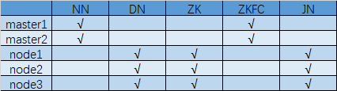
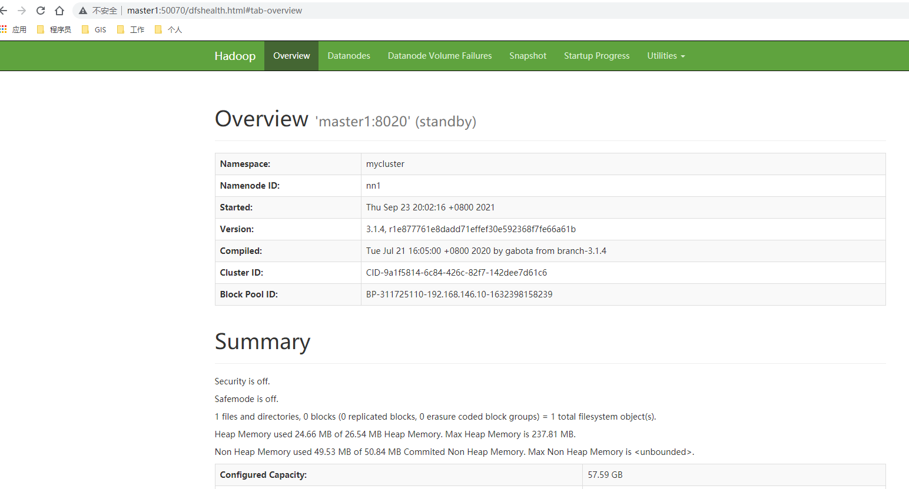
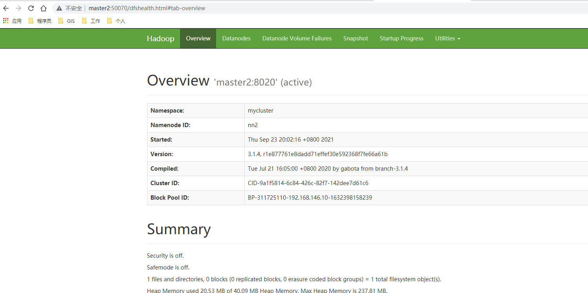
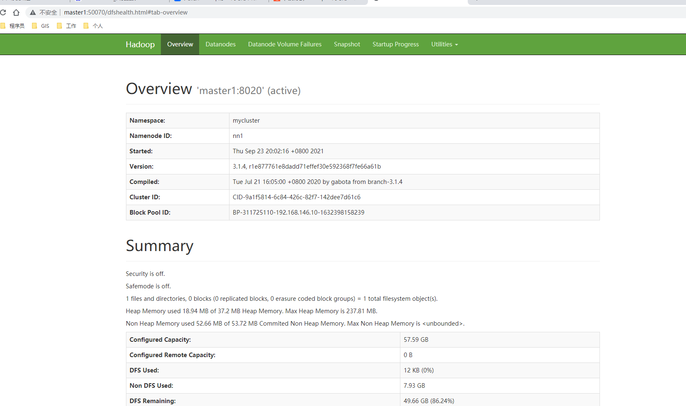

# Hadoop3.1.4完全高可用模式部署


## 准备工作

- 五台局域网内互通机器，以下简称master1，master2,slave1,slave2,slave3

- 部署节点列表

 

- 所需软件：
  - jdk-8u281-linux-x64.tar.gz
  - apache-zookeeper-3.6.1-bin.tar.gz
  - hadoop-3.1.4.tar.gz

## 基础设施

- 所有机器均要进行以下操作

- 关闭防火墙

  ​	systemctl stop firewalld.service

- 关闭防火墙开机启动

  ​	systemctl disable firewalld.service

- 永久关闭selinux

  ​	vi /etc/selinux/config

  ​		修改：SELINUX=disabled

- 时间同步

  ​	yum install ntp

  ​	vi /etc/ntp.conf

  ​		增加：server ntp1.aliyun.com

  ​	systemctl start ntpd

  ​	systemctl enable ntpd

- 修改主机名

  ​	vi /etc/hostname

  ​		增加：主机名（master1）

  ​	reboot

- 添加IP映射

  ​	vi /etc/hosts

  ​		192.168.146.10 master1  
  ​		192.168.146.11 master2  
  ​		192.168.146.12 node1  
  ​		192.168.146.13 node2  
  ​		192.168.146.14 node3  

  ​	source /etc/hosts

- 安装JDK

  ​	解压：tar -zxvf jdk-8u152-linux-x64.tar.gz

  ​	环境变量：

  ​		vi /etc/profile

  ​			export JAVA_HOME=/APP/software/jdk1.8.0_281
  ​			export PATH=$PATH:$JAVA_HOME/bin

  ​		source /etc/profile

- ssh免密钥登录

  ​	ssh-keygen -t dsa -P '' -f ~/.ssh/id_dsa

  

  ​	scp /root/.ssh/id_dsa.pub xx:/root/.ssh/xx.pub

  ​	cat /root/.ssh/xx.pub >> /root/.ssh/authorized_keys

  

## 安装ZooKeeper

- Node1,Node2,Node3进行以下操作

- 解压

  ​	tar -zxvf apache-zookeeper-3.6.1-bin.tar.gz

- 修改配置文件

  ​	cd conf

  ​	cp zoo_sample.cfg zoo.cfg

  ​	vi zoo.cfg

  ​		修改：dataDir=/APP/data/zookeeper

  ​		新增：

  ​			server.1=node1:2888:3888  
  ​			server.2=node2:2888:3888  
  ​			server.3=node3:2888:3888  

- 创建数据存储目录

  ​	mkdir -p /APP/data/zookeeper

- 创建ID标识（根据机器进行不同编号书写）

  ​	echo 1 > /APP/data/zookeeper/myid

- 增加环境变量

  ​	vi /etc/profile

  ​		export ZOOKEEPER_HOME=/APP/software/apache-zookeeper-3.6.1  

  ​		export PATH=$PATH:$JAVA_HOME/bin:$ZOOKEEPER_HOME/bin

  ​	source /etc/profile


## 安装Hadoop

- 所有机器均要进行以下操作

- 解压Hadoop

  ​	tar -zxvf hadoop-3.1.4.tar.gz

- 增加Java环境变量

  ​	vi hadoop-env.sh

  ​		export HDFS_NAMENODE_USER=root  
  ​		export HDFS_DATANODE_USER=root  
  ​		export HDFS_JOURNALNODE_USER=root  
  ​		export HDFS_ZKFC_USER=root  
  ​		export YARN_RESOURCEMANAGER_USER=root  
  ​		export YARN_NODEMANAGER_USER=root  
  ​		export HDFS_SECONDARYNAMENODE_USER=root  

  ​		export JAVA_HOME=/APP/software/jdk1.8.0_281  

- 修改配置文件

  - core-site.xml

    ```xml
    <configuration>
        <property>
            <name>fs.defaultFS</name>
            <value>hdfs://mycluster</value>
        </property>
        <property>
            <name>hadoop.tmp.dir</name>
            <value>/APP/data/hadoop/tmp</value>
        </property>
        <property>
            <name>ha.zookeeper.quorum</name>
            <value>node1:2181,node2:2181,node3:2181</value>
        </property>
    </configuration>
    ```

  - hdfs-site.xml

    ```xml
    <configuration>
        <property>
            <name>dfs.replication</name>
            <value>2</value>
        </property>
        <property>
            <name>dfs.namenode.name.dir</name>
            <value>/APP/data/hadoop/name</value>
        </property>
        <property>
            <name>dfs.datanode.data.dir</name>
            <value>/APP/data/hadoop/data</value>
        </property>
        <property>
    	<name>dfs.nameservices</name>
    	<value>mycluster</value>
        </property>
        <property>
            <name>dfs.ha.namenodes.mycluster</name>
            <value>nn1,nn2</value>
        </property>
        <property>
            <name>dfs.namenode.rpc-address.mycluster.nn1</name>
            <value>master1:8020</value>
        </property>
        <property>
            <name>dfs.namenode.rpc-address.mycluster.nn2</name>
            <value>master2:8020</value>
        </property>
        <property>
            <name>dfs.namenode.http-address.mycluster.nn1</name>
            <value>master1:50070</value>
        </property>
        <property>
            <name>dfs.namenode.http-address.mycluster.nn2</name>
            <value>master2:50070</value>
        </property>
        <property>
            <name>dfs.namenode.shared.edits.dir</name>
            <value>qjournal://node1:8485;node2:8485;node3:8485/mycluster</value>
        </property>
        <property>
            <name>dfs.journalnode.edits.dir</name>
            <value>/APP/data/hadoop/journal</value>
        </property>
        <property>
            <name>dfs.client.failover.proxy.provider.mycluster</name>
            <value>org.apache.hadoop.hdfs.server.namenode.ha.ConfiguredFailoverProxyProvider</value>
        </property>
        <property>
            <name>dfs.ha.fencing.methods</name>
            <value>shell(/bin/true)</value>
        </property>
        <property>
            <name>dfs.ha.fencing.ssh.private-key-files</name>
            <value>/root/.ssh/id_dsa</value>
        </property>
        <property>
            <name>dfs.ha.automatic-failover.enabled</name>
            <value>true</value>
         </property>
         <property>
            <name>dfs.webhdfs.enabled</name>
            <value>true</value>
        </property>
        <property>
            <name>dfs.permissions.enabled</name>
            <value>false</value>
        </property>
    </configuration>
    ```

  - mapred-site.xml

    ```xml
    <configuration>
        <property>
            <name>mapreduce.framework.name</name>
    	<value>yarn</value>
        </property>
        <property>
            <name>yarn.app.mapreduce.am.env</name>
            <value>HADOOP_MAPRED_HOME=$HADOOP_HOME</value>
        </property>
        <property>
            <name>mapreduce.map.env</name>
            <value>HADOOP_MAPRED_HOME=$HADOOP_HOME</value>
        </property>
        <property>
            <name>mapreduce.reduce.env</name>
            <value>HADOOP_MAPRED_HOME=$HADOOP_HOME</value>
        </property>
    </configuration>
    ```

  - yarn-site.xml

    ```xml
    <configuration>
        <property>
            <name>yarn.nodemanager.aux-services</name>
            <value>mapreduce_shuffle</value>
        </property>
        <property>
            <name>yarn.resourcemanager.ha.enabled</name>
            <value>true</value>
        </property>
        <property>
             <name>yarn.resourcemanager.zk-address</name>
             <value>node1:2181,node2:2181,node3:2181</value>
        </property>
        <property>
            <name>yarn.resourcemanager.cluster-id</name>
            <value>liuhui</value>
        </property>
        <property>
            <name>yarn.resourcemanager.ha.rm-ids</name>
            <value>rm1,rm2</value>
        </property>
        <property>
            <name>yarn.resourcemanager.hostname.rm1</name>
            <value>master1</value>
        </property>
        <property>
            <name>yarn.resourcemanager.hostname.rm2</name>
            <value>master2</value>
        </property>
            <property>
            <name>yarn.resourcemanager.webapp.address.rm1</name>
            <value>master1:8088</value>
        </property>
        <property>
            <name>yarn.resourcemanager.webapp.address.rm2</name>
            <value>master2:8088</value>
        </property>
    </configuration>
    ```

  - workers

    ```
    node1
    node2
    node3
    ```

- 配置环境变量

  ​	vi /etc/profile

  ​		export HADOOP_HOME=/APP/software/hadoop-3.1.4  
  ​		export PATH=$PATH:$JAVA_HOME/bin:$HADOOP_HOME/sbin:$HADOOP_HOME/bin  

  ​	source /etc/profile

  

## 首次启动

- 启动ZooKeeper（node1,node2,node3）

  ​	zkServer.sh start

- 启动JournalNode（node1,node2,node3）

  ​	hadoop-daemon.sh start journalnode

- 格式化NameNode（master1，仅一次）

  ​	hdfs namenode -format

- 启动格式化好的NameNode

  ​	hadoop-daemon.sh start namenode

- 另一台Master执行StandBy

  ​	hdfs namenode -bootstrapStandby

- 格式化高可用（master1，仅一次）

  ​	hdfs zkfc -formatZK

- 启动Hadoop

  ​	start-all.sh

  

## 集群验证

- Master节点进程
  - NameNode
  - ResourceManager
  - DFSZKFailoverController
- Node节点进程
  - QuorumPeerMain
  - NodeManager
  - DataNode
  - JournalNode

- 网页验证

  - master1:50070

    

- - master2:50070

    


## 高可用验证

- 杀掉Active的NameNode（Master2）

- 观察另一台NameNode，是否成为Active状态

  


## 后续启动

- 启动ZooKeeper

  ​	zkServer.sh start

- 启动Hadoop

  ​	start-all.sh
