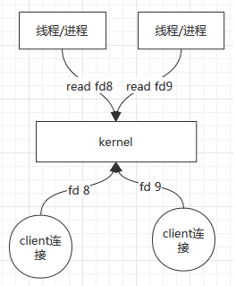
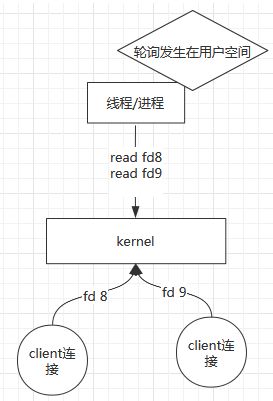
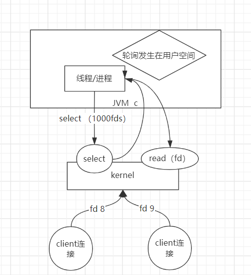
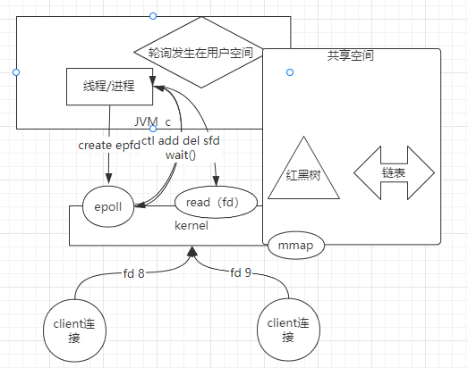
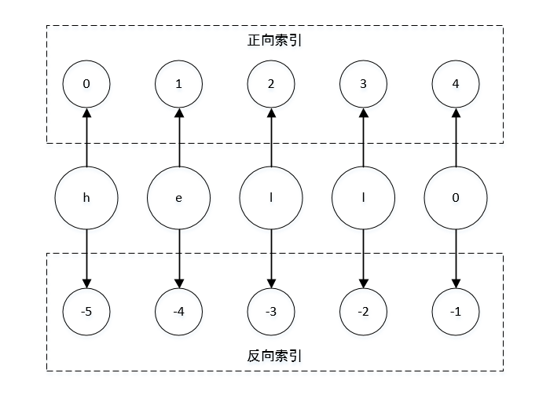
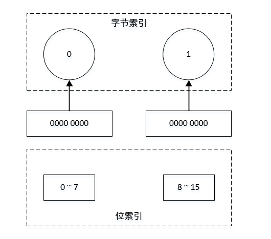
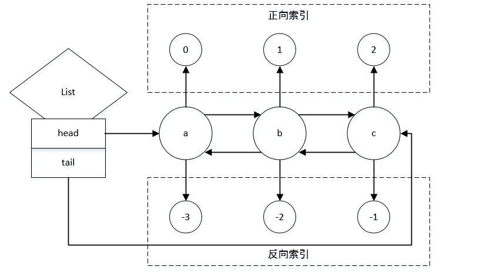

# Table of Contents

* [Redis](#redis)
  * [简介](#简介)
  * [Redis的优缺点](#redis的优缺点)
  * [Redis为什么速度快](#redis为什么速度快)
  * [Redis数据类型](#redis数据类型)
    * [String](#string)
    * [List](#List)


# Redis

## 简介

- Redis(Remote Dictionary Server)，远程数据字典服务，内存高速缓存数据库，数据模型是key-value
- Redis支持丰富的数据结构类型，比如字符串(string)、散列(hashes)、列表(lists)、集合(sets)、有序集合(sorted sets)


## Redis的优缺点

- **优点**
  - 速度快，数据存储在内存中，类似于HashMap
  - 支持丰富的数据类型
  - 支持事务，操作都是原子性的
  - 丰富的特性，可用于缓存，消息，按照Key设置过期时间，过期后自动删除
  - 支持数据持久化，支持AOF和RDB两种持久化方式
  - 支持主从复制，Master会自动将数据同步到Slave
- **缺点**
  - 单线程
  - 对一致性Hash支持有线
  - 持久化操作需要很大的系统开销
  - 数据库容量受到物理内存的限制
  - 不具备自动容错和自动恢复
  - 主机宕机，宕机前部分数据未同步，会导致数据不一致的问题
  - 较难支持在线扩容


## Redis为什么速度快

- 完全基于内存操作
- 数据结果简单，对数据操作简单
- 采用单线程，避免线程间的上下文切换，不用考虑线程安全和锁
- 使用多路I/O复用模型，非阻塞IO


- <font color='red'>**什么是多路I/O复用模型？**</font>

  - **BIO：同步并阻塞，服务器实现模式为一个连接一个线程**

     

    - 操作系统内核提供read(系统调用)，读文件描述符
    - 一个clinet连接就是一个文件描述符ID
    - socket连接是阻塞的，socket产生的文件描述符，如fd8，当数据包没有到达的时候，左边的read fd8不能返回，且阻塞
    - 即有一个clinet连接，就需要开一个进程（或者线程），有数据就处理，没有数据就阻塞

    

    - 缺点
      - 几个连接几个线程，一个CPU在某一时间片上，只能一个进程（线程）进行处理，就算另外一个数据到了，也不能进行处理，造成CPU资源浪费
      - 开线程数过多，成本很高
      
      

  - **NIO：同步非阻塞，服务器实现模式为一个请求一个线程**

     

    - linux内核提供的socket是可以非阻塞的

    - 既然socket不阻塞，那么一个进程（线程就够了），在进程里面写循环，即一个一个问fd有没有数据，即轮询，发生在用户空间遍历，取出来自己处理，为同步非阻塞

      

    - 缺点

      - C10K问题：如果有1w个客户端，代表用户进程需要访问1w次内核，用户态和内核态反复切换，成本开销很大
  
      
  
  - SELECT
  
      
  
     - 假设有1000个fd，进程需要吧1000个fd春给select，内核监控这些fd，发现哪些fd准备好，则返回fd，然后进程再拿准备好的fd调用read
     - 即多路复用，选择谁数据有了，直接执行，减少用户态和内核态的切换
  
     
  
     - 缺点
       - 每次需要把1000个fd传进去，再返回，用户态和内核态需要fd传来传去
  
     
  
  - epoll
  
      
  
     - epoll是一个整体，包含epoll_create,epoll_ctl,epoll_wait三个系统调用
     - 共享空间，进程把fd存放红黑树，内核通过红黑树拿fd去查询哪个IO数据到达，把到达的放到链表里，然后进程从链表去对应的fd
  
     - 大致过程
       - 进程首先调用epoll_create，创建一个epoll文件描述符
       - epoll通过mmap开辟一块共享空间（红黑树+链表），增删改由内核完成，查询则内核和用户进程都可以
       - 进程调用epoll的ctl add/delete sfd，把新来的连接放入红黑树中
       - 进程调用wait()，等待事件驱动
       - 当红黑树中的fd有数据到了，就把他放入链表中，并维护该数据是可写还是可读，wait返回
       - 上层空间通过epoll从链表中去除fd，然后调用read/write读写数据


## Redis数据类型

### String

- 字符串

- 普通字符串类型

  - 正反向索引

    

  - 使用方法

    - set

      ```shell
      #设置单个元素的值
      127.0.0.1:6379> set k1 liuhui
      ```
    
    - set nx
    
      ```shell
      #只有当元素不存在时，才能设置成功
      127.0.0.1:6379> set k1 a nx
      OK
      127.0.0.1:6379> set k1 a nx
      (nil)
      ```
    
    - set xx
    
      ```shell
      #只有当元素存在时，才能设置成功，即更新
      127.0.0.1:6379> set k1 a xx
      (nil)
      127.0.0.1:6379> set k1 a
      OK
      127.0.0.1:6379> set k1 b xx
      OK
      127.0.0.1:6379> get k1
      "b"
      ```

    - get
    
      ```shell
      #获取单个元素的值
      127.0.0.1:6379> get k1
      "liuhui"
      ```
    
    - getset
    
      ```shell
      #获取某个元素的当前值，并将新值赋值给他
      127.0.0.1:6379> getset k1 c
      "b"
      127.0.0.1:6379> get k1
      "c"
      ```
    
    - mset
    
      ```shell
      #设置多个元素的值
      127.0.0.1:6379> mset k1 a k2 b
      OK
      ```
    
    - mget
    
      ```shell
      #获取多个元素的值
      127.0.0.1:6379> mget k1 k2
      1) "a"
      2) "b"
      ```
    
    - append
    
      ```shell
      #追加某个元素的值
      127.0.0.1:6379> append k1 niubi
      127.0.0.1:6379> get k1
      "liuhuiniubi"
      ```
    
    - setrange
    
      ```shell
      #从指定位置开始设置新的值
      127.0.0.1:6379> setrange k1 6 queshi
      127.0.0.1:6379> get k1
      "liuhuiqueshi"
      ```
    
    - getrange
    
      ```shell
      #截取字符串
      127.0.0.1:6379> getrange k1 0 5
      "liuhui"
      #h获取全部字符串
      127.0.0.1:6379> getrange k1 0 -1
      "liuhuiqueshi"
    
    - strlen
    
      ```shell
      #获取字符串长度
      127.0.0.1:6379> strlen k1
      (integer) 16
      ```

- 数值

  - 数值类型

  - 使用方法

    - INCR

      ```shell
      #初始化
      127.0.0.1:6379> set k1 99
      OK
      #把当前数值增加1
      127.0.0.1:6379> incr k1
      (integer) 100
      #把当前数值增加10
      127.0.0.1:6379> incrby k1 10
      (integer) 110
      ```

    - DECR

      ```shell
      #把当前数值减1
      127.0.0.1:6379> decr k1
      (integer) 109
      #把当前数值减10
      127.0.0.1:6379> decrby k1 10
      (integer) 99
      ```

    - INCRBYFLOAT

      ```shell
      #把当前数值加0.5
      127.0.0.1:6379> incrbyfloat k1 0.5
      "99.5"
      #把当前数值减0.5
      #注意：没有DECRBYFLOAT方法，只能通过INCRBYFLOAT方法，将增加的数值设置为负数
      127.0.0.1:6379> incrbyfloat k1 -0.5
      "99"
      ```

- bitmap

  - 二进制位图

  - 位图存储形式

    

  - 使用方法

    - setbit

      ```shell
      #设置位图的值，设置k1位图的第1位为1，即0100 0000
      127.0.0.1:6379> setbit k1 1 1
      (integer) 0
      127.0.0.1:6379> get k1
      "@"
      #设置位图的值，设置k1位图的第7位为1，即0100 0001
      127.0.0.1:6379> setbit k1 7 1
      (integer) 0
      127.0.0.1:6379> get k1
      "A"
      ```

    - strlen

      ```shell
      #查看位图的长度（字节长度）
      127.0.0.1:6379> strlen k1
      (integer) 1
      #设置位图的值，设置k1位图的第9位为1，即0100 0001 0100 0000，此时k1的长度应该为2
      127.0.0.1:6379> setbit k1 9 1
      (integer) 0
      127.0.0.1:6379> strlen k1
      (integer) 2
      ```

    - bitpos

      ```shell
      #查看k1位图，第0个字节，第一个出现1的位置
      127.0.0.1:6379> bitpos k1 1 0 0
      (integer) 1
      #查看k1位图，第1个字节，第一个出现1的位置
      127.0.0.1:6379> bitpos k1 1 1 1
      (integer) 9
      #查看k1位图，第0-1个字节，第一个出现1的位置
      127.0.0.1:6379> bitpos k1 1 0 1
      (integer) 1
      ```

    - bitcount

      ```shell
      #查看k1位图，第0个字节，1出现的次数
      127.0.0.1:6379> bitcount k1 0 0
      (integer) 2
      #查看k1位图，第1个字节，1出现的次数
      127.0.0.1:6379> bitcount k1 1 1
      (integer) 1
      #查看k1位图，第0-1个字节，1出现的次数
      127.0.0.1:6379> bitcount k1 0 1
      (integer) 3
      ```

    - bitop

      ```shell
      127.0.0.1:6379> setbit k1 1 1
      (integer) 0
      127.0.0.1:6379> setbit k1 7 1
      (integer) 0
      127.0.0.1:6379> get k1
      "A"
      127.0.0.1:6379> setbit k2 1 1
      (integer) 0
      127.0.0.1:6379> setbit k2 6 1
      (integer) 0
      127.0.0.1:6379> get k2
      "B"
      #位图操作，k1和k2进行与操作，并赋值给k3
      127.0.0.1:6379> bitop and k3 k1 k2
      (integer) 1
      127.0.0.1:6379> get k3
      "@"
      #位图操作，k1和k2进行或操作，并赋值给k4
      127.0.0.1:6379> bitop or k4 k1 k2
      (integer) 1
      127.0.0.1:6379> get k4
      "C"
      ```


- bitmap的应用

  - 用户系统：统计用户登录天数

    ```shell
    setbit username1 1 1
    setbit username1 7 1
    setbit username1 354 1
    #最后两天的登录次数
    bitcount username1 -2 -1

  - 用户系统

    ```shell
    #setbit 日期 用户id 登录标识
    setbit 20200101 1 1
    setbit 20200102 1 1
    setbit 20200102 7 1
    #日期间进行或操作
    bitop or destkey 20190101 20190102
    #统计活跃用户数
    bitcount destkey 0 -1
    ```

    

### List

- 存储模型

  

- 使用方法

  - lpush

    ```shell
    #lpush，从左向右push元素
    127.0.0.1:6379> lpush k1 a b c d e f
    (integer) 6
    ```

  - rpush

    ```shell
    #rpush，从右向左push元素
    127.0.0.1:6379> rpush k2 a b c d e f
    (integer) 6
    ```

  - lrange

    ```shell
    #取出元素，从第0位，到-1位
    127.0.0.1:6379> lrange k1 0 -1
    1) "f"
    2) "e"
    3) "d"
    4) "c"
    5) "b"
    6) "a"
    127.0.0.1:6379> lrange k2 0 -1
    1) "a"
    2) "b"
    3) "c"
    4) "d"
    5) "e"
    6) "f"
    127.0.0.1:6379> 
    ```

  - lpop

    ```shell
    #从左边弹出元素
    127.0.0.1:6379> lpop k1
    "f"
    127.0.0.1:6379> lpop k1
    "e"
    127.0.0.1:6379> lpop k1
    "d"
    ```

  - rpop

    ```shell
    #从右边弹出元素
    127.0.0.1:6379> rpop k1
    "a"
    127.0.0.1:6379> rpop k1
    "b"
    127.0.0.1:6379> rpop k1
    "c"
    ```

  - lpush <-> lpop

    ```shell
    #从左边push元素，从左边pop元素，相当于栈，先进后出
    127.0.0.1:6379> lpush k1 a b c d
    (integer) 4
    127.0.0.1:6379> lpop k1 
    "d"
    127.0.0.1:6379> lpop k1 
    "c"
    127.0.0.1:6379> lpop k1 
    "b"
    127.0.0.1:6379> lpop k1 
    "a"
    ```

  - lpush <-> rpop

    ```shell
    #从左边push元素，从右边pop元素，相当于队列，先进先出
    127.0.0.1:6379> lpush k1 a b c d
    (integer) 4
    127.0.0.1:6379> rpop k1
    "a"
    127.0.0.1:6379> rpop k1
    "b"
    127.0.0.1:6379> rpop k1
    "c"
    127.0.0.1:6379> rpop k1
    "d"
    ```

  - lindex

    ```shell
    #取第N个元素的值
    127.0.0.1:6379> rpush k1 a b c d
    (integer) 4
    127.0.0.1:6379> lindex k1 2
    "c"
    ```

  - lset

    ```shell
    #设置第N个元素的值
    127.0.0.1:6379> rpush k1 a b c d
    (integer) 4
    127.0.0.1:6379> lset k1 2 g
    OK
    127.0.0.1:6379> lrange k1 0 -1
    1) "a"
    2) "b"
    3) "g"
    4) "d"
    ```

  - lrem

    ```shell
    127.0.0.1:6379> rpush k1 a b a c a d a e
    (integer) 8
    127.0.0.1:6379> lrange k1 0 -1
    1) "a"
    2) "b"
    3) "a"
    4) "c"
    5) "a"
    6) "d"
    7) "a"
    8) "e"
    #移除k1前2个值为a的元素
    127.0.0.1:6379> lrem k1 2 a
    (integer) 2
    127.0.0.1:6379> lrange k1 0 -1
    1) "b"
    2) "c"
    3) "a"
    4) "d"
    5) "a"
    6) "e"
    #移除k1后1个值为a的元素
    127.0.0.1:6379> lrem k1 -1 a
    (integer) 1
    127.0.0.1:6379> lrange k1 0 -1
    1) "b"
    2) "c"
    3) "a"
    4) "d"
    5) "e"
    ```

  - linsert

    ```shell
    127.0.0.1:6379> rpush k1 a b c d e 
    (integer) 5
    #在元素c后面添加一个g
    127.0.0.1:6379> linsert k1 after c g
    (integer) 6
    127.0.0.1:6379> lrange k1 0 -1
    1) "a"
    2) "b"
    3) "c"
    4) "g"
    5) "d"
    6) "e"
    #在元素b之前添加一个f
    127.0.0.1:6379> linsert k1 before b f
    (integer) 7
    127.0.0.1:6379> lrange k1 0 -1
    1) "a"
    2) "f"
    3) "b"
    4) "c"
    5) "g"
    6) "d"
    7) "e"
    ```

  - llen

    ```shell
    127.0.0.1:6379> llen k1
    (integer) 7
    ```

  - blpop

    ```shell
    #阻塞直到取到元素
    127.0.0.1:6379> blpop k1 0
    #阻塞直到取到元素，最大时间为10s
    127.0.0.1:6379> blpop k1 10
    ```

  - ltrim

    ```shell
    #移除指定区间外的所有元素
    127.0.0.1:6379> rpush k1 a b c d e f
    (integer) 6
    127.0.0.1:6379> ltrim k1 2 -3
    OK
    127.0.0.1:6379> lrange k1 0 -1
    1) "c"
    2) "d"
    ```


### Hash

- 键值对

- 使用方法

  - hset

    ```shell
    127.0.0.1:6379> hset person name liuhui
    (integer) 1
    ```

  - hget

    ```shell
    127.0.0.1:6379> hget person name
    "liuhui"
    ```

  - hmset

    ```shell
    127.0.0.1:6379> hmset person name liuhui age 18 sex man
    OK
    ```

  - hmget

    ```shell
    127.0.0.1:6379> hmget person name age sex
    1) "liuhui"
    2) "18"
    3) "man"
    ```

  - hkeys

    ```shell
    127.0.0.1:6379> hkeys person
    1) "name"
    2) "age"
    3) "sex"
    ```

  - hvals

    ```shell
    127.0.0.1:6379> hvals person
    1) "liuhui"
    2) "18"
    3) "man"
    ```

  - hgetall

    ```shell
    127.0.0.1:6379> hgetall person
    1) "name"
    2) "liuhui"
    3) "age"
    4) "18"
    5) "sex"
    6) "man"
    ```

  - hincrbyfloat

    ```shell
    127.0.0.1:6379> hincrbyfloat person age 0.5
    "18.5"
    127.0.0.1:6379> hget person age
    "18.5"
    127.0.0.1:6379> hincrbyfloat person age -0.5
    "18"
    127.0.0.1:6379> hget person age
    "18"
    ```

- hincrby/hincrbyfloat的应用

  - 点赞、收藏、商品详情页等


### Set

- 无序且随机

- 使用方法

  - sadd

    ```shell
    127.0.0.1:6379> sadd k1 a b c d e f
    (integer) 6
    ```

  - smembers

    ```shell
    127.0.0.1:6379> smembers k1
    1) "b"
    2) "a"
    3) "d"
    4) "f"
    5) "e"
    6) "c"
    ```

  - srem

    ```shell
    127.0.0.1:6379> srem k1 a
    (integer) 1
    127.0.0.1:6379> smembers k1
    1) "d"
    2) "f"
    3) "e"
    4) "c"
    5) "b"
    ```

  - sinter

    ```shell
    127.0.0.1:6379> sadd k1 a b c d 
    (integer) 4
    127.0.0.1:6379> sadd k2 c d e f
    (integer) 4
    #取k1,k2的交集
    127.0.0.1:6379> sinter k1 k2
    1) "d"
    2) "c"
    #取k1,k2的交集，并存储在k3
    127.0.0.1:6379> sinterstore k3 k1 k2
    (integer) 2
    127.0.0.1:6379> smembers k3
    1) "c"
    2) "d"
    ```

  - sunion

    ```shell
    127.0.0.1:6379> sunion k1 k2
    1) "d"
    2) "e"
    3) "f"
    4) "a"
    5) "c"
    6) "b"
    127.0.0.1:6379> sunionstore k3 k1 k2
    (integer) 6
    127.0.0.1:6379> smembers k3
    1) "d"
    2) "e"
    3) "f"
    4) "a"
    5) "c"
    6) "b"
    ```

  - sdiff

    ```shell
    #注意前后顺序
    127.0.0.1:6379> sdiff k1 k2
    1) "a"
    2) "b"
    127.0.0.1:6379> sdiff k2 k1
    1) "e"
    2) "f"
    127.0.0.1:6379> sdiffstore k3 k1 k2
    (integer) 2
    127.0.0.1:6379> smembers k3
    1) "a"
    2) "b"
    127.0.0.1:6379> sdiffstore k3 k2 k1
    (integer) 2
    127.0.0.1:6379> smembers k3
    1) "e"
    2) "f"
    127.0.0.1:6379> 
    ```

  - spop

    ```shell
    #随机弹出元素
    127.0.0.1:6379> spop k1
    "a"
    127.0.0.1:6379> spop k1
    "c"
    127.0.0.1:6379> spop k1
    "b"
    127.0.0.1:6379> spop k1
    "d"
    127.0.0.1:6379> spop k1
    (nil)
    ```

  - srandom

    ```shell
    #count参数为正：取出一个去重的结果集，不会超过当前集合
    127.0.0.1:6379> sadd k1 a b c d e f
    (integer) 6
    127.0.0.1:6379> srandmember k1 3
    1) "e"
    2) "a"
    3) "b"
    127.0.0.1:6379> srandmember k1 10
    1) "b"
    2) "a"
    3) "d"
    4) "f"
    5) "e"
    6) "c"
    #count参数为负：取出一个带重复的结果集，一定满足数据量，不超过当前set长度也有可能会重复
    127.0.0.1:6379> srandmember k1 -2
    1) "e"
    2) "e"
    127.0.0.1:6379> srandmember k1 -10
     1) "e"
     2) "b"
     3) "a"
     4) "c"
     5) "e"
     6) "a"
     7) "f"
     8) "f"
     9) "e"
    10) "a"
    ```


### Sorted Set

- 有序集合

- 使用方法

  - zadd

    ```shell
    #赋值元素，分值和元素
    127.0.0.1:6379> zadd k1 8 apple 2 banana 3 orange
    (integer) 3
    ```

  - zrange

    ```shell
    #从小到大取出元素
    127.0.0.1:6379> zrange k1 0 -1
    1) "banana"
    2) "orange"
    3) "apple"
    #从小到大取出元素，并显示对应分数
    127.0.0.1:6379> zrange k1 0 -1 withscores
    1) "banana"
    2) "2"
    3) "orange"
    4) "3"
    5) "apple"
    6) "8"
    ```

  - zrevrange

    ```shell
    #从大到小取出元素
    127.0.0.1:6379> zrevrange k1 0 -1
    1) "apple"
    2) "orange"
    3) "banana"
    ```

  - zrangebyscore

    ```shell
    #按照分数取出元素，最小为3，最大为8
    127.0.0.1:6379> zrangebyscore k1 3 8
    1) "orange"
    2) "apple"
    ```

  - zsocre

    ```shell
    #取对应元素的分值
    127.0.0.1:6379> zscore k1 banana
    "2"
    ```

  - zrank

    ```shell
    #取对应元素的排名
    127.0.0.1:6379> zrank k1 apple
    (integer) 2
    ```

  - zincrby

    ```shell
    #对对应元素的分值进行修改，并会重新进行排序
    127.0.0.1:6379> zadd k1 8 apple 2 banana 3 orange
    (integer) 3
    127.0.0.1:6379> zrange k1 0 -1 withscores
    1) "banana"
    2) "2"
    3) "orange"
    4) "3"
    5) "apple"
    6) "8"
    127.0.0.1:6379> zincrby k1 2.5 banana
    "4.5"
    127.0.0.1:6379> zrange k1 0 -1 withscores
    1) "orange"
    2) "3"
    3) "banana"
    4) "4.5"
    5) "apple"
    6) "8"
    ```

  - zunion

    ```shell
    #将k1和k2合并成k3，默认权重为1，聚合公式为sum
    127.0.0.1:6379> zadd k1 60 user1 40 user2 30 user3
    (integer) 3
    127.0.0.1:6379> zadd k2 20 user1 80 user2 40 user3
    (integer) 3
    127.0.0.1:6379> zunionstore k3 2 k1 k2
    (integer) 3
    127.0.0.1:6379> zrange k3 0 -1 withscores
    1) "user3"
    2) "70"
    3) "user1"
    4) "80"
    5) "user2"
    6) "120"
    #将k1和k2合并成k3，设置k1权重为1，k2权重为0.5，默认聚合公式为sum
    127.0.0.1:6379> zadd k1 60 user1 40 user2 30 user3
    (integer) 3
    127.0.0.1:6379> zadd k2 20 user1 80 user2 40 user3
    (integer) 3
    127.0.0.1:6379> zunionstore k3 2 k1 k2 weights 1 0.5
    (integer) 3
    127.0.0.1:6379> zrange k3 0 -1 withscores
    1) "user3"
    2) "50"
    3) "user1"
    4) "70"
    5) "user2"
    6) "80"
    #将k1和k2合并成k3，设置k1权重为1，k2权重为0.5，聚合公式为max
    127.0.0.1:6379> zadd k1 60 user1 40 user2 30 user3
    (integer) 3
    127.0.0.1:6379> zadd k2 20 user1 80 user2 40 user3
    (integer) 3
    127.0.0.1:6379> zunionstore k3 2 k1 k2 weights 1 0.5 aggregate max
    (integer) 3
    127.0.0.1:6379> zrange k3 0 -1 withscores
    1) "user3"
    2) "30"
    3) "user2"
    4) "40"
    5) "user1"
    6) "60"
    ```

    


