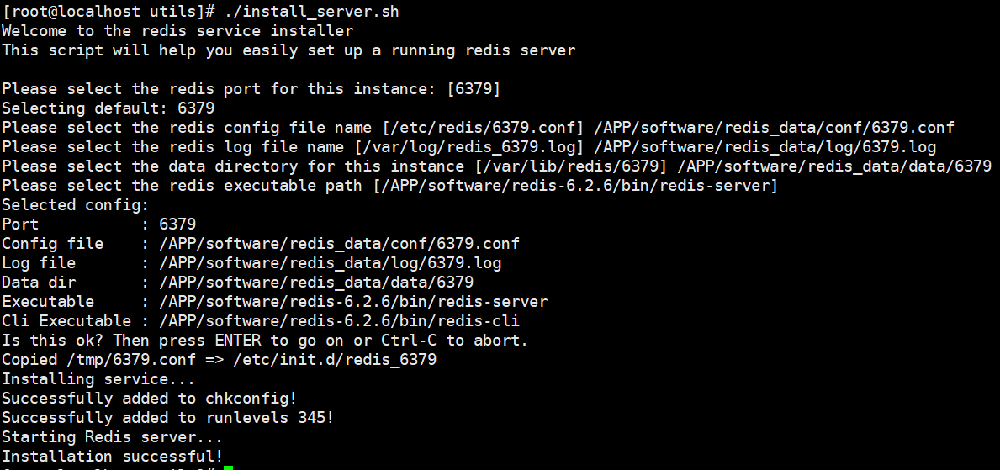

# Table of Contents

* [Redis6.2.6部署](#redis626部署)
  * [安装wget](#安装wget)
  * [下载安装包](#下载安装包)
  * [解压安装包](#解压安装包)
  * [安装GCC](#安装gcc)
  * [编译](#编译)
  * [安装](#安装)
  * [配置环境变量](#配置环境变量)
  * [安装服务](#安装服务)
  * [查看服务](#查看服务)


# Redis6.2.6部署

## 安装wget

- yum install wget


## 下载安装包

- wget http://download.redis.io/releases/redis-6.2.6.tar.gz


## 解压安装包

- tar -zxvf redis-6.2.6.tar.gz


## 安装GCC

- yum install gcc


## 编译

- cd /APP/software/redis-6.2.6
- make


## 安装

- make install PREFIX=/APP/software/redis-6.2.6


## 配置环境变量

- vi /etc/profile

  ```shell
  export REDIS_HOME=/APP/software/redis-6.2.6
  export PATH=$PATH:$REDIS_HOME/bin
  ```

- source /etc/profile

  

## 安装服务

- cd /APP/software/redis-6.2.6/utils

- ./install_server.sh

  

- 安装服务会根据参数自动创建相应的目录和文件，并且会开启相应端口的Redis服务
- 安装服务会在/etc/init.d目录下创建脚本文件，实现开机自启动


- <font color='red'>**Please take a look at the provided example service unit files in this directory, and adapt and install them. Sorry!**</font>

- 解决方案

  - vi ./install_server.sh 

  - 注释下面的代码即可:

    ```
    #bail if this system is managed by systemd
    #_pid_1_exe="$(readlink -f /proc/1/exe)"
    #if [ "${_pid_1_exe##*/}" = systemd ]
    #then
    #       echo "This systems seems to use systemd."
    #       echo "Please take a look at the provided example service unit files in this directory, and adapt and install them. Sorry!"
    #       exit 1
    #fi
    ```

## 查看服务

- service redis_6379 status


