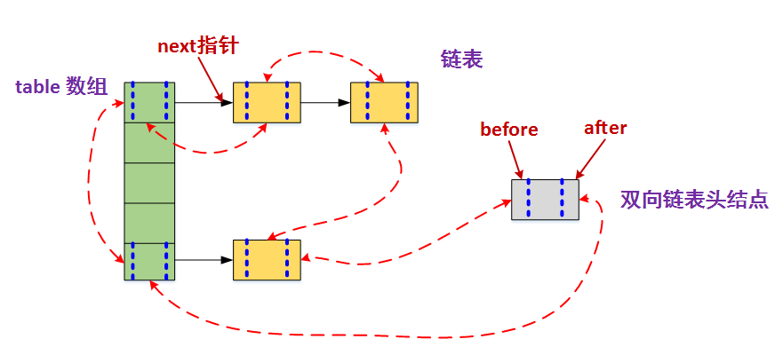
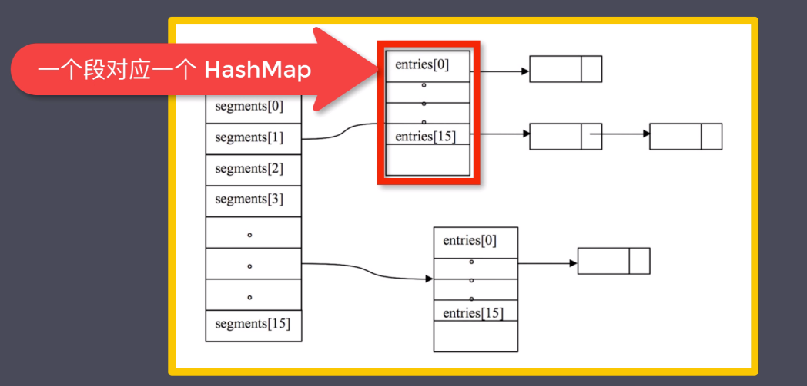

# Table of Contents

* [集合](#集合)
  * [List：有序的Collection](#list有序的collection)
    * [基础数据结构](#基础数据结构)
      * [ArrayList](#arraylist)
      * [Vector](#vector)
      * [LinkedList](#linkedlist)
    * [ArrayList和Vector的区别](#arraylist和vector的区别)
    * [ArrayList和LinkedList的区别](#arraylist和linkedlist的区别)
  * [Set：存储无序，没有重复值](#set存储无序没有重复值)
    * [基础数据结构](#基础数据结构-1)
      * [HashSet（Hash表）](#hashsethash表)
      * [TreeSet（二叉树）](#treeset二叉树)
      * [LinkedHashSet（HashSet+LinkedHashMap）](#linkedhashsethashsetlinkedhashmap)
    * [HashSet的实现原理](#hashset的实现原理)
  * [Map](#map)
    * [基础数据结构](#基础数据结构-2)
      * [HashMap（数组+链表+红黑树）](#hashmap数组链表红黑树)
      * [ConcurrentHashMap](#concurrenthashmap)
      * [HashTable](#hashtable)
      * [TreeMap](#treemap)
      * [LinkedHashMap](#linkedhashmap)
    * [解决哈希冲突的方法](#解决哈希冲突的方法)
    * [JDK1.7和JDK1.8版本中HashMap的对比](#jdk17和jdk18版本中hashmap的对比)
    * [HashMap怎么设定初始容量的大小](#hashmap怎么设定初始容量的大小)
    * [HashMap的哈希函数是如何设计的](#hashmap的哈希函数是如何设计的)
    * [JDK1.8中，HashMap扩容后不需要rehash的原因、HashMap扩容为什么要是2的幂](#jdk18中hashmap扩容后不需要rehash的原因hashmap扩容为什么要是2的幂)
    * [LinkedHashMap的两种排序方式，及利用LinkedHashMap实现LRU算法](#linkedhashmap的两种排序方式及利用linkedhashmap实现lru算法)
    * [TreeMap的底层实现原理（红黑树后补充）](#treemap的底层实现原理红黑树后补充)
    * [TreeMap的Key对象为什么一定要实现Compare接口（红黑树后补充）](#treemap的key对象为什么一定要实现compare接口红黑树后补充)
    * [如何利用TreeMap实现一致性哈希（红黑树后补充）](#如何利用treemap实现一致性哈希红黑树后补充)
    * [](#)
    * [ConcurrentHashMap的底层实现原理](#concurrenthashmap的底层实现原理)


# 集合

## List：有序的Collection

### 基础数据结构

#### ArrayList

- 内部通过数组实现，允许对元素进行快速随机访问
- 数组缺点是每个元素间不能有间隔，当数组大小不满足时需要增加存储能力，就要将已经有数组的数据复制到新的存储空间中
- 当ArrayList的中间位置插入或者删除元素时，需要对数组进行复制和移动，代价较高
- 适合随机查找和遍历，不适合插入和删除

#### Vector

- 内部通过数组实现，支持线程的同步，即某一时刻只有一个线程能够访问Vector
- 实现同步需要很高的花费，所以访问比ArrayList慢

#### LinkedList

- 内部通过链表实现，适合数据的动态插入和删除，随机访问和遍历比较慢
- 提供了专门用于操作表头和表尾元素的方法，可以当作堆、栈、队列和双向队列使用


### ArrayList和Vector的区别

- **同步性**
  - Vector是线程安全的，ArrayList是非线程安全的
- **数据增长**
  - Vector扩容时增长为原来的2倍，ArrayList增长为原来的1.5倍
  - ArrayList和Vector都能设置初始大小，Vector能设置增长空间的大小，ArrayList不能
- **性能**
  - ArrayList在性能方面比要优于Vecotr


### ArrayList和LinkedList的区别

- **底层原理**
  - ArrayList是动态数组，LinkedList是双向链表
- **随机访问效率**
  - ArrayList在随机访问时的效率要高，LinkedList是线性存储结构，需要移动指针从前往后依次查找
- **增加和删除效率**
  - 非首尾操作时，LinkedList效率要高，ArrayList增删操作会影响数组内其他数据的下标
- **内存空间占比**
  - LinkedList占用内存要比ArrayList要高
- **线程安全**
  - 都不能保证线程安全


## Set：存储无序，没有重复值

### 基础数据结构

#### HashSet（Hash表）

- 存放的是哈希值
- 存储元素的顺序并不是按照存入时的顺序，而是按照哈希值来存的
- HashSet首先判断两个元素的哈希值，如果不同则存储，如果相同，在用equals方法判断是否为同一对象

#### TreeSet（二叉树）

- 使用二叉树的原理，对新增加的对象按照指定的顺序排序，每增加一个对象都会进行排序，将对象插入二叉树的指定位置
- Integer和String对象都可以进行默认的TreeSet排序，自定义的类必须实现Comparable接口，重写compareTo才可以使用
- 重写compareTo，要返回相应的值才能使TreeSet按照一定的规则排序
- 比较对象与指定对象的顺序，该对象小于、等于、或大于指定对象，分别返回负整数、零、正整数

#### LinkedHashSet（HashSet+LinkedHashMap）

- 继承HashSet，基于LinkedHashMap实现

- LinkedHashSet根据元素哈希值来决定元素存储位置，同时使用链表 维护元素的次序

- LinkedHashSet需要维护元素的插入顺序，性能略低，但是能够更好的迭代访问元素

  

### HashSet的实现原理

- HashSet是基于HashMap实现的，HashSet的值存放于HashMap的key上
- HashSet的value统一为PRESENT


## Map

### 基础数据结构

#### HashMap（数组+链表+红黑树）

- HashMap（数组+链表+红黑树）**根据哈希值存储数据，大多数情况下可以直接定位到它的值，具有很快的访问速度，遍历顺序不确定
- HashMap非线程安全
- HashMap实现方式
  - JDK 1.7：数组+链表
  - JDK 1.8：数组+链表+红黑树

#### ConcurrentHashMap

- ConcurrentHashMap线程安全，由一个个Segment组成，Segment通过继承ReentrantLock进行加锁，每次需要加锁的操作锁住的是一个Segment，保证每个Segment的线程安全
- ConcurrentHashMap一共有16个Segment，最多同时支持16个线程并发，这个值可以在初始化的时候设置，但是一旦初始化以后，是不支持扩容的

#### HashTable

- 线程安全，遗留类，不需要线程安全的场景用HashMap替换，需要线程安全的场景用ConcurrentHashMap替换

#### TreeMap

- 实现SortedMap接口，能够恩据键排序，默认是按键值的升序，也可以指定排序的比较器
- 在使用TreeMap时，key必须实现Comparable接口，或者在构造TreeMap的时候传入自定义的Comparator

#### LinkedHashMap

- 有序的HashMap

- 基本原理：HashMap+双向链表

  

### 解决哈希冲突的方法

- 开放定址法
- 链表法
- 再哈希法
- 公共溢出表法


### JDK1.7和JDK1.8版本中HashMap的对比

- **实现原理**
  - JDK1.7：数组+链表
  - JDK1.8：数组+链表+红黑树
- **链表插入方式**
  - JDK1.7：头插法
  - JDK1.8：尾插法

- **扩容判定**
  - JDK1.7：先判断是否需要扩容，再进行插入
  - JDK1.8：先插入，在判断是否需要扩容
- **扩容操作**
  - JDK1.7：需要rehash
  - JDK1.8：采用简单的判断逻辑定位，位置不变或者索引+旧容量大小


- **JDK1.7和JDK1.8HashMap非线程安全的原因**
  - JDK1.7：并发扩容时，rehash可能会导致A.next = B.next, B.next = A.next这种环形链表
  - JDK1.8：并发put时，会导致数据覆盖


- **HashMap链表结构转为链表+红黑树的原因**
  - 若桶中链表元素个数大于等于8时，链表转换成树结构；若桶中链表元素个数小于等于6时，树结构还原成链表。
  - 因为红黑树的平均查找长度log(n)，当长度大于8时才有必要转为红黑树
  - 还有选择6和8，中间有个差值7，防止频繁转换


### HashMap怎么设定初始容量的大小

- 如果new HashMap()不传初始大小参数，则默认大小为16，负载因子为0.75
- 如果传入初始大小参数k，初始化大小为大于k的2的整数次方


### HashMap的哈希函数是如何设计的

- 拿到一个key的hashcode值，是一个32位的int值，然后让高的16位和低的16位进行异或操作
- 源码：(h=key.hashCode()) ^ (h >>> 16)
- 举例

```
		"vin".hashCode = 116763
原码：   0000 0000 0000 0001 1100 1000 0001 1011
>>>16:  0000 0000 0000 0000 0000 0000 0000 0001
^运算：  0000 0000 0000 0001 1100 1000 0001 1010
```


### JDK1.8中，HashMap扩容后不需要rehash的原因、HashMap扩容为什么要是2的幂

					原始索引		 数组大小
	数组大小16		0000 0101	&	0000 1111	=	0000 0101
	数组大小32		0000 0101	&	0001 1111	=	0000 0101	(与扩容前一致)
	
	数组大小16		0001 0101	&	0000 1111	=	0000 0101
	数组大小32		0001 0101	&	0001 1111	=	0001 0101	(比扩容前大)


### LinkedHashMap的两种排序方式，及利用LinkedHashMap实现LRU算法

- 两种排序方式
  - 按插入顺序(accessOrder = false)
  - 按最近获取顺序(accessOrder = true)
- LinkedHashMap实现LRU(Least Recently Used)算法

```java
public class LRUCache<K, V> extends LinkedHashMap<K, V> {
    
    private static final int MAX_NODE_NUM = 100;

	private int limit;

	public LRUCache() {
        this(MAX_NODE_NUM);
    }

	public LRUCache() {
        super(limit, 0.75f, true);
        this.limit = limit;
    }

	public V save(K key, V value) {
        return put(key, val);
    }

	punlic V getOne(K key) {
        return get(key);
    }

	public boolean exists(K key) {
        return containsKey(key);
    }
    
    @override
    protected boolean removeEldesEntry(Map.Entry<K, V> eldest) {
        return size() > limit;
    }
}
```


### TreeMap的底层实现原理（红黑树后补充）

参考连接：http://www.tianxiaobo.com/categories/

### TreeMap的Key对象为什么一定要实现Compare接口（红黑树后补充）

参考连接：http://www.tianxiaobo.com/categories/

### 如何利用TreeMap实现一致性哈希（红黑树后补充）

参考连接：http://www.tianxiaobo.com/categories/

### 

### ConcurrentHashMap的底层实现原理

- JDK1.7

  - **数组+Segment+分段锁**

    

    

    采用分段式锁的方式，把全局加锁的方式变为局部加锁

  - **优点**

    - 写操作时，可以只对元素所在的Segment段进行加锁，不会影响到其余的Segment，最理想的情况下可以同时支持Segment数量大小的写操作

  - **缺点**

    - Hash的过程要比普通的HashMap长，需要经过两次hash计算，分别计算所处的Segment和HashEntry
    - 分段锁会形成很多段，浪费内存空间（不连续，碎片化）

    

- JDK1.8

  - **数组+链表+红黑树，内部采用大量CAS操作,synchronized操作来保证线程安全**
  - **put实现**
    - 如果相应位置的Node还未初始化，则通过CAS插入相应的数据
    - 如果相应的Node位置不为空，且该节点不处于移动状态，则对该节点加synchronized锁，如果该节点的hash不小于0，则遍历链表更新节点或插入新节点
    - 如果该节点是TreeBin类型的节点，说明是红黑树结构，则通过putTreeVal方法往红黑树中插入节点
    - 如果binCount不为0，说明put操作对数据产生了影响，如果当前链表个数达到8个，则通过treeifyBin方法转化为红黑树，如果oldVal不为空，说明是一次更新，没有对元素个数产生影响，则直接返回旧值
    - 如果插入的是一个新的节点，则执行addCount()方法更新元素个数binCount


- **总结**
  - **数据结构**
    - 取消Segment分段锁，用数组+链表+红黑树替代
  - **保证线程安全**
    - 取消Segment分段锁，用CAS+Synchronized替代
  - **锁的粒度**
    - JDK1.7锁的是Segment，JDK1.8锁的是Node
  - **链表转化为红黑树**
    - 定位hash算法简化，导致hash冲突加剧，所以用红黑树替代链表
  - **查询时间复杂度**
    - 由遍历链表O(n)，变为遍历红黑树0(logN)
  - **扩容**
    - JDK1.8中多线程参与扩容，每个线程操作16个hash桶
    - 对于读操作，如果当前节点有数据，还没迁移完成，此时不影响读，能够正常进行。如果当前链表已经迁移完成，此时get线程会帮助扩容。
    - 对于写操作，如果当前链表已经迁移完成，此时写线程会帮助扩容，如果扩容没有完成，当前链表的头节点会被锁住，所以写线程会被阻塞，直到扩容完成。

