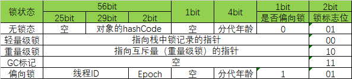

# JVM

## 基础入门

### Java运行过程

Java源文件通过编译，生成相应的class文件，也就是字节码文件。字节码文件通过Java虚拟机中的解释器，编译成特定机器上的机器码

​	Java源文件 -> 编译器 -> Class文件 -> JVM -> 机器码

​	

### 常见JVM的实现

​	


### JDK,JRE,JVM

- JDK：jre + development kit
- JRE：JVM + core lib
- JVM：Java Virtual Machine


### JVM类加载机制

- **加载（Loading）**：在内存中生成一个代表这个类的Class对象，作为方法去的这个类的各种数据的入口
- **连接（Linking）**
  - **验证（Verification）**：确保Class文件的字节流中包含的信息是否符合当前虚拟机的要求
  - **准备（Preparation）**：为类变量分配内存并设置初始值，即为变量分配内存空间
  - **解析（Resolution）**：将常量池中的符号引用替换为直接引用的过程
- **初始化（Initializing）**：为类的静态变量赋予正确的初始值


### JVM类加载器

- **启动类加载器（Bootstrap ClassLoader）**：加载JAVA_HOME/lib目录中的类
- **扩展类加载器（Extension ClassLoader）**：加载JAVA_HOME/lib/ext目录中的类
- **应用程序类加载器（Application ClassLoader）**：加载用户路径（classpath）中的类
- **自定义类加载器（Custom ClassLoader）**：通过实现findClass方法，加载自定义的类
  - 通过自定义类加载器可以实现Class文件的热加载，重写loadClass方法
  - 通过自定义类加载器可以对Class文件进行加密，生成Class时进行异或，加载Class时再进行异或
  - extends ClassLoader -> overwrite findClass() -> defineClass(byte[] -> Class<?> classz)


### 双亲委派

JVM是按需动态加载，采用双亲委派机制。自底向下检查该类是否已经加载（parent方向），然后自顶向下，进行实际查找和加载（child方向）


### 为什么采用双亲委派

- **资源**：避免同一类被加载多次，防止资源浪费
- **安全**：防止自定义实现基础类，导致安全事故发生（比如复写java.lang.String类，然后记录用户密码）


### JVM编译模式

- 混合模式
  - 混合使用解释器+热点代码编译
  - 初始阶段采用解释执行
  - 热点代码检测
    - 多次被调用的方法（方法计数器：检测方法执行频率）
    - 多次被调用的循环（循环计数器：检测循环执行频率）
    - 进行编译
- 命令
  - -Xmixed：默认为混合模式，开始解释执行，启动速度较快，对热点代码实行检测和编译
  - -Xint：解释模式，启动很快，执行稍慢
  - -Xcomp：编译模式，执行很快，启动稍慢


### 缓存行伪共享问题

- 读取缓存是以cache line为基本单位的，目前基本上都是64bytes，位于同一缓存行的两个不同数据，被两个不同的CPU锁定，产生互相影响的伪共享问题

- 解决方法：使用缓存行对齐的方式

  ```java
  // 缓存行未对齐
  private static class T {
  	public volatile long x = 0L;
  }
  
  // 缓存行对齐
  private static class Padding {
  	public volatile long p1, p2, p3, p4, p5, p6, p7;
  }
  
  private static class T extends Padding {
  	public volatile long x = 0L;
  }	
  ```


### CPU指令乱序问题

- CPU为了提高指令执行效率，会在一条指令执行过程中（比如去内存读数据（慢100倍）），去同时执行另一条指令，前提是，两条指令没有依赖关系

- CPU指令乱序问题证明

  ```java
  public class Disorder {
      
      private static int x = 0, y = 0;
      private static int a = 0, b =0;
  
      public static void main(String[] args) throws InterruptedException {
          int i = 0;
          for(;;) {
              i++;
              x = 0; y = 0;
              a = 0; b = 0;
              Thread one = new Thread(new Runnable() {
                  public void run() {
                      //由于线程one先启动，下面这句话让它等一等线程two. 读着可根据自己电脑的实际性能适当调整等待时间.
                      //shortWait(100000);
                      a = 1;
                      x = b;
                  }
              });
  
              Thread other = new Thread(new Runnable() {
                  public void run() {
                      b = 1;
                      y = a;
                  }
              });
              one.start();other.start();
              one.join();other.join();
              String result = "第" + i + "次 (" + x + "," + y + "）";
              if(x == 0 && y == 0) {
                  System.err.println(result);
                  break;
              } else {
                  //System.out.println(result);
              }
          }
      }
  
  
      public static void shortWait(long interval){
          long start = System.nanoTime();
          long end;
          do{
              end = System.nanoTime();
          }while(start + interval >= end);
      }
  }
  ```

   

- 第4446712次时出现了指令重排


### 如何保证指令有序

- 硬件内存屏障（x86）
  - sfence：store | 在sfence指令前面的写操作必须在sfence指令后的写操作前完成
  - lfence：load | 在lfence指令前面的读操作必须在lfence指令后的读操作前完成
  - mfence：modify/mix | 在mfence指令前的读写操作必须在mfence指令后的读写操作前完成
- JVM内存屏障
  - LoadLoad屏障
    - 对于这样的语句Load1;LoadLoad;Load2
    - 在Load2及后续读取操作要读取的数据被访问之前，要保证Load1要读取的数据被读取完成
  - StoreStore屏障
    - 对于这样的语句Store1;StoreStore;Store2
    - 在Store2及后续写入操作执行之前，要保证Store1的写入操作对其他处理器可见
  - LoadStore屏障
    - 对于这样的语句Load1;LoadStore;Store2
    - 在Store2及后续的写入操作被刷出前，要保证Load1尧都区的数据被读取完毕
  - StoreLoad屏障
    - 对于这样的语句Store1;StoreLoad;Load2
    - 在Load2及后续读取操作执行前，保证Store1的写入对所有处理器可见


### vloatile的实现细节

- 字节码层面
  - ACC_VOLATILE
- JVM层面
  - volatile内存区的读写操作增加屏障
    - StoreStoreBarrier -> volatile写 -> StoreLoadBarrier
    - LoadLoadBarrier -> volatile读 -> LoadStoreBarrier
- OS和硬件层面
  - windows的lock指令


### synchronized的实现细节

- 字节码层面
  - monitorenter monitorexit
- JVM层面
  - C C++ 调用了操作系统提供的同步机制
- OS和硬件层面
  - windows的lock指令


### CPU合并写问题

- 当CPU执行存储指令时，首先试图将数据写到L1_Cache，如果L1_Cache没有命中，则会使用一个另外的缓冲区，叫做合并写缓冲区（WCBuffer）

- CPU会把待写入的数据写入到合并写缓冲区，该缓冲区大小和一个cache line相同，一般都是64字节

- 这个缓冲区允许cpu在写入或者读取数据的同时继续执行其他指令

- 如果我们在缓冲区传输到缓存之前将其尽可能填满，这样的效果会提高各级传输总线的效率，以提高程序性能

  ```java
  public final class WriteCombining {
  
      private static final int ITERATIONS = Integer.MAX_VALUE;
      private static final int ITEMS = 1 << 24;
      private static final int MASK = ITEMS - 1;
  
      private static final byte[] arrayA = new byte[ITEMS];
      private static final byte[] arrayB = new byte[ITEMS];
      private static final byte[] arrayC = new byte[ITEMS];
      private static final byte[] arrayD = new byte[ITEMS];
      private static final byte[] arrayE = new byte[ITEMS];
      private static final byte[] arrayF = new byte[ITEMS];
  
      public static void main(final String[] args) {
  
          for (int i = 1; i <= 3; i++) {
              System.out.println(i + " SingleLoop duration (ns) = " + runCaseOne());
              System.out.println(i + " SplitLoop  duration (ns) = " + runCaseTwo());
          }
      }
  
      public static long runCaseOne() {
          long start = System.nanoTime();
          int i = ITERATIONS;
  
          while (--i != 0) {
              int slot = i & MASK;
              byte b = (byte) i;
              arrayA[slot] = b;
              arrayB[slot] = b;
              arrayC[slot] = b;
              arrayD[slot] = b;
              arrayE[slot] = b;
              arrayF[slot] = b;
          }
          return System.nanoTime() - start;
      }
  
      public static long runCaseTwo() {
          long start = System.nanoTime();
          int i = ITERATIONS;
          while (--i != 0) {
              int slot = i & MASK;
              byte b = (byte) i;
              arrayA[slot] = b;
              arrayB[slot] = b;
              arrayC[slot] = b;
          }
          i = ITERATIONS;
          while (--i != 0) {
              int slot = i & MASK;
              byte b = (byte) i;
              arrayD[slot] = b;
              arrayE[slot] = b;
              arrayF[slot] = b;
          }
          return System.nanoTime() - start;
      }
  }
  ```
  
- runCaseOne函数需要连续写入6个不同位置的内存，那么当4个数据写满了合并写缓冲区时，CPU要等待合并写缓冲区更新到L2_Cache中，CPU被强制暂停

- runCaseTwo函数每次写入4个不同位置的内存，很好的利用了合并写缓冲区


### 对象在内存中的布局

- 普通对象
  - 对象头：markword 8字节
  - ClassPointer指针： -XX:+UseCompressedClassPointers为4字节，不开启为8字节
  - 实例数据：引用类型：-XX:UseCompressedOops为4字节，不开启为8字节
  - padding对齐，8的倍数
- 数组对象
  - 对象头：markword 8字节
  - ClassPointer指针同上
  - 数组长度：4字节
  - 数组数据
  - padding对齐，8的倍数


### 对象头的组成

- 32位

   

  

- 64位

   

  

## JVM内存模型

### JVM内存模型


- **线程私有区域：生命周期与线程相同，依赖线程的启动/结束而创建/销毁**
  - **程序计算器**

    - 一块较小的内存空间，是当前线程所执行的字节码的行号指示器
    - 唯一一个不会在JVM中出现OutOfMemoryError的区域

  - **虚拟机栈**
    - 每个方法被执行的时候都会创建一个栈帧用于存储变量表，操作数栈，动态连接，方法返回地址等信息
      - **栈帧**
        - **局部变量区**：逻辑连续得内存空间，最小单位是Slot，用来存放方法参数和方法内部定义的局部变量
        - **操作数栈**：Java虚拟机提供指令让操作数栈对一些数据进行操作
        - **动态连接**：方法调用时，方法名字需要解析和连接成相应的引用的过程
        - **方法返回地址**：返回一个值给调用它的方法，a() -> b()，b()的返回值放在什么地方
  - **本地方法栈**
    - 与虚拟机栈发挥的作用类似，区别是虚拟机栈执行的是Java方法（字节码），本地方法栈则为虚拟机使用到的native方法服务，可能底层调用的是C或者C++

- **线程共享区域：生命周期随虚拟机的启动/关闭而创建/销毁**
  - **JVM堆内存**

    - 存放的是对象，垃圾收集器就是收集这些对象，然后根据GC算法回收

    

  - **JVM非堆内存**

    - 永久代，也成为方法区。存储程序运行时长期存活的对象，比如类的元数据，方法，常量，属性等
    - 在JDK1.8版本中，废弃了永久代，代替的是元空间，元空间不存在于JVM内存之中，而是使用本地内存
      - Perm Space(JDK < 1.8)
        - 字符串常量位于Perm Space
        - 启动时设置大小，不能修改，FGC不清理
      - Meta Space(JDK >= 1.8)
        - 字符串常量位于堆内存
        - 默认最大是物理空间，触发FGC清理


### JVM内存中栈和堆的区别

- **功能不同**：
  - 栈内存是用来存储局部变量，堆内存用来存储Java中的对象，栈内存的更新速度要快于堆内存。
  - 栈内存生命周期结束就会被释放，堆内存要通过GC才能进行回收
- **共享性不同**：栈内存是线程私有，堆内存是所有线程共享的
- **异常错误不同**
  - 栈内存：java.lang.StackOverFlowError
  - 堆内存：java.lang.OutOfMemoryError
- **空间大小**：栈内存要远小于堆内存


## JVM垃圾回收

### JVM如何确定垃圾

- **引用计数法**
  - 在Java中，引用和对象是关联的，如果要操作对象必须用引用进行，因此可以通过引用计数来判断一个对象是否可以回收
  - 两个对象相互引用，即使没有外部引用，也会导致内存不能释放
- **可达性分析**
  - 通过一系列的GC roots对象作为起点搜索，如果在GC roots和一个对象之间没有可达路径，则该对象是不可达的
  - 不可达对象不等价于可回收对象，不可达对象至少要经过两次标记过程，才会被回收
  - GC roots：线程栈变量、静态变量、常量池、JNI指针


### JVM垃圾回收算法

- **标记清除算法（Mark-Sweep）**

  - 最基础的垃圾回收算法，分为两个阶段，标记和清除，标记阶段标记出所有需要回收的对象，清除阶段将其回收
  - 容易出现内存碎片化严重，后续可能发生大对象不能找到可利用空间的问题
  - 存在两遍扫描的过程，第一遍需要找出存活的对象，第二遍要清除未标记的对象

- **复制算法（copying）**

  - 按内存容量将内存划分为等大小的两块，每次只使用其中的一块，当这一块内存满后，将还存活的对象复制到另一块，把已使用的内存清楚
  - 实现简单，内存效率高，不容易产生碎片，最大的问题是可用内存被压缩到了原本的一半，并且存活对象增多的话，复制算法效率很低
  - 空间浪费，移动复制对象，需要调整对象引用

- **标记整理/标记压缩算法（Mark-Compat）**

  - 结合标记清除算法和复制算法，标记出所有需要回收的对象，标记后将存活对象移动到内存的一端，然后清除边界外的对象
  - 扫描两次，需要移动对象，效率偏低
  - 不会产生碎片，方便对象分配，不会产生内存减半

- **分代收集算法**

  - 根据对象存活的不同生命是周期，将内存划分为不同的域，一般情况下划分为老年代和新生代

  - 老年代的特点是每次垃圾回收时，只有少量对象需要被回收

  - 新生代的特点是每次垃圾回收时，都有大量的垃圾需要回收

  - 新生代采用复制算法

  - 老年代采用标记整理算法

    

  - A,C：从eden区扫描，存活的对象拷贝到to区

  - B：从eden区扫描存活的对象，如果to区空间不足，直接拷贝到old区

  - D：从from区扫描存活对象，如果对象存活次数超过阈值，移动到old区

  - E：从from区扫描存活对象，如果对象存货次数没有超过阈值，移动到to区

  - G：释放old区


### 对象何时进入老年代

- 超过XX:MaxTenuringThreshold指定次数
  - Parallel Scavenage：15
  - CMS：6
  - G1：15
- 动态年龄
  - from -> to 内存超过50%，把年龄最大的放入老年代
  - https://www.jianshu.com/p/989d3b06a49d


### JVM垃圾回收

- Minor GC / YGC ：清理年轻代，在年轻代空间耗尽时触发
  - 复制 —> 清空 -> 互换
  - 清空eden，from空间
  - from和to空间互换
- Major GC / FGC ：清理堆空间，在老年代无法继续分配空间时触发，新生代和老年代同时进行回收
  - 扫描一次所有老年代，标记出存活对象，然后回收没有标记的对象
  - 进行Major GC之前一般都会先进行一次Minor GC


### JVM垃圾回收器的发展历史

JDK诞生，Serial追随，为了提高效率，诞生了PS，为了配合CMS，诞生了PN，CMS是JDK1.4版本后期引入，CMS是里程碑式的GC，他开启了并发回收的过程，但是CMS问题比较多，因此目前没有任何版本JDK默认是CMS，并发垃圾回收的原因就是无法忍受STW（stop-the-world）


### JVM垃圾回收器的分代模型

- Epsilon，ZGC，Shenandoah不分代
- G1是逻辑分代，物理不分代
- 其余垃圾回收器逻辑分代，物理分代


### JVM垃圾回收器

- Serial
  - 单线程，复制算法的新生代垃圾收集器
  - 简单高效，对于限定单个CPU环境来说，没有线程交互的开销
  - 在进行垃圾收集的同时，所有其他线程必须要暂停，等待垃圾收集完成（STW：stop-the-world）
- Serial Old
  - 单线程，标记整理算法的老年代垃圾收集器
  - 在进行垃圾收集的同时，所有其他线程必须要暂停，等待垃圾收集完成（STW：stop-the-world）
  - JVM在Client模式下默认的老年代垃圾收集器
  - CMS垃圾收集器的后备垃圾手机方案


- Parallel Scavenge
  - 多线程，复制算法的新生代垃圾收集器
  - 在进行垃圾收集的同时，所有其他线程必须要暂停，等待垃圾收集完成（STW：stop-the-world）
  - 吞吐量优先，重点关注的是程序达到一个可控制的吞吐量，高吞吐量可以最高效率的利用CPU时间，尽快完成程序的任务，主要适用于后台运算而不需要太多交互的任务
- Parallel Old
  - 多线程，标记整理算法的老年代垃圾收集器
  - 在进行垃圾收集的同时，所有其他线程必须要暂停，等待垃圾收集完成（STW：stop-the-world）


- ParNew
  - 多线程，复制算法的新生代垃圾收集器
  - ParNew默认开启和CPU数目相同的线程数，可以通过-XX:ParallelGCThreads参数来限制垃圾收集器的线程数
  - 响应时间优先，重点关注的是垃圾收集的响应时间
  - Parallel Scavenge的变种，能够配合CMS使用
- CMS
  - 多线程，标记清除算法的的老年代收集器
  - 最主要的目标是获取最短垃圾回收停顿时间，最短的垃圾收集停顿时间可以为交互比较高的程序提供用户体验
  - CMS工作机制相比其他的垃圾收集器更复杂，整个过程分为以下4个阶段
    - **初始标记：**只是标记以下GC Roots能直接关联的对象，速度很快，仍然需要暂停所有的工作线程
    - **并发标记：**进行GC Roots跟踪的过程，和用户线程一起工作，不需要暂停工作线程
    - **重新标记：**为了休证在并发标记期间，因用户程序继续运行而导致标记产生变动的那一部分对象的标记记录，仍然需要暂停所有的工作线程
    - **并发清除：**清除GC Roots不可达对象，和用户线程一起工作，不需要暂停工作线程 
  - 由于耗时最长的并发标记和并发清除过程中，垃圾收集线程可以和用户现在一起并发工作，所以总体上来看CMS收集器的内存回收和用户线程是一起并发的执行
- G1


### CMS的问题

- 内存碎片化严重
  - -XX:+UseCMSCompactAtFullCollection
  - -XX:CMSFullGCBeforeCompaction
- 浮游垃圾
  - Concurrent Mode Failure
    - 解决方案：降低触发CMS的阈值
  - Promotion Failed
    - 解决方案：保持老年代有足够的空间
    - -XX:CMSInitiatingOccupancyFraction降低这个值，让CMS保证老年代有足够的空间
