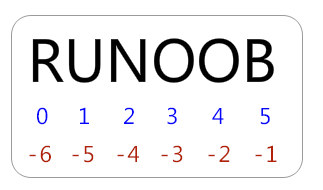

# Python


## Python中文编码

### 设置中文编码的方式

- **# -\*- coding: UTF-8 -\*-**
- **# coding=utf-8**


## Python缩进方式

- 单个制表符、两个空格、四个空格，不能混用


## Python引号

- 可以使用引号，双引号，三引号来表示字符串，引号开始的结束必须是相同类型

  ```python
  word = 'word'
  sentence = "这是一个句子。"
  paragraph = """这是一个段落。
  ```


## Python注释

- 单行注释用#开头

  ```python
  # 注释注释
  ```

- 多行注释用三个单引号或者三个双引号

  ```python
  '''
  这是多行注释
  '''
  
  """
  这特么也是，你说带劲不
  """
  ```


## Python变量赋值

```python
# 整型变量
count = 100
# 浮点型变量
miles = 1000.0
# 字符串
name = "Jhon"

# 多变量赋值
a = b = c = 1
a, b, c = 1, 2, "Jhon"
```


## Python标准数据类型

- Numbers（数字）
- String（字符串）
- List（列表）
- Tuple（元组）
- Dictionary（字典）


### Python数字

- int（有符号整型）
- long（长整型）（Python3.x版本移除，int溢出后自动变为long）
- float（浮点型）
- complex（复数）


### Python字符串

- 字符串索引

  - 从左到右索引默认0开始，最大范围是字符串长度-1

  - 从右到左索引默认从-1开始，最大范围是字符串开头

     

- 字符串截取

  [头下标:尾下标]

  ```python
  >>> s = 'abcdef'
  >>> s[1:5]
  'bcde'
  ```

  [头下标:尾下标:步长]

  ```python
  >>> letters = 'checkio'
  >>> letters[1:4:2]
  'hc'
  ```

- 基础用法

  ```python
  str = 'Hello World!'
   
  print str           # 输出完整字符串
  print str[0]        # 输出字符串中的第一个字符
  print str[2:5]      # 输出字符串中第三个至第六个之间的字符串
  print str[2:]       # 输出从第三个字符开始的字符串
  print str * 2       # 输出字符串两次
  print str + "TEST"  # 输出连接的字符串
  ```


### Python列表

- 列表索引
  - 从左到右索引默认0开始，最大范围是列表长度-1
  - 从右到左索引默认从-1开始，最大范围是列表开头

- 基础用法

  ```python
  list = [ 'runoob', 786 , 2.23, 'john', 70.2 ]
  tinylist = [123, 'john']
   
  print list               # 输出完整列表
  print list[0]            # 输出列表的第一个元素
  print list[1:3]          # 输出第二个至第三个元素 
  print list[2:]           # 输出从第三个开始至列表末尾的所有元素
  print tinylist * 2       # 输出列表两次
  print list + tinylist    # 打印组合的列表
  ```


### Python元组

- 类似于List

- 不能二次赋值，相当于只读列表

- 基础用法

  ```python
  tuple = ( 'runoob', 786 , 2.23, 'john', 70.2 )
  tinytuple = (123, 'john')
   
  print tuple               # 输出完整元组
  print tuple[0]            # 输出元组的第一个元素
  print tuple[1:3]          # 输出第二个至第四个（不包含）的元素 
  print tuple[2:]           # 输出从第三个开始至列表末尾的所有元素
  print tinytuple * 2       # 输出元组两次
  print tuple + tinytuple   # 打印组合的元组
  ```


### Python字典

- 无序的对象集合，字典中的元素捅过键来存取，不能通过便宜来存取

- 基础用法

  ```python
  dict = {}
  dict['one'] = "This is one"
  dict[2] = "This is two"
   
  tinydict = {'name': 'runoob','code':6734, 'dept': 'sales'}
   
   
  print dict['one']          # 输出键为'one' 的值
  print dict[2]              # 输出键为 2 的值
  print tinydict             # 输出完整的字典
  print tinydict.keys()      # 输出所有键
  print tinydict.values()    # 输出所有值
  ```


## Python运算符


### Python算术运算符

- +-*/ : 加减乘除
- ** : 幂，返回x的y次幂，a**b
- // : 取整除，向下取整


### Python比较运算符

- == != <> > < >= <=


### Python赋值运算符

- = += -= *= /= %= **= //=


### Python位运算符

- & | ^ ~ << >>


### Python逻辑运算符

- and : 布尔与
- or : 布尔或
- not : 布尔非


### Python成员运算符

- in
- not in


### Python身份运算符

- is
- is not
- **<font color="red">is用来判断两个变量引用对象是否位同一个（同一块内存空间），==用于判断引用变量的值是否相等</font>**


## Python条件语句

```python
a = 1
while a < 7 :
    if (a % 2 == 0) : 
        print(a, "is even")
    else :
        print(a, "is odd")
        a += 1
        
        
num = 5     
if num == 3:            # 判断num的值
    print 'boss'        
elif num == 2:
    print 'user'
elif num == 1:
    print 'worker'
elif num < 0:           # 值小于零时输出
    print 'error'
else:
    print 'roadman'     # 条件均不成立时输出
```


